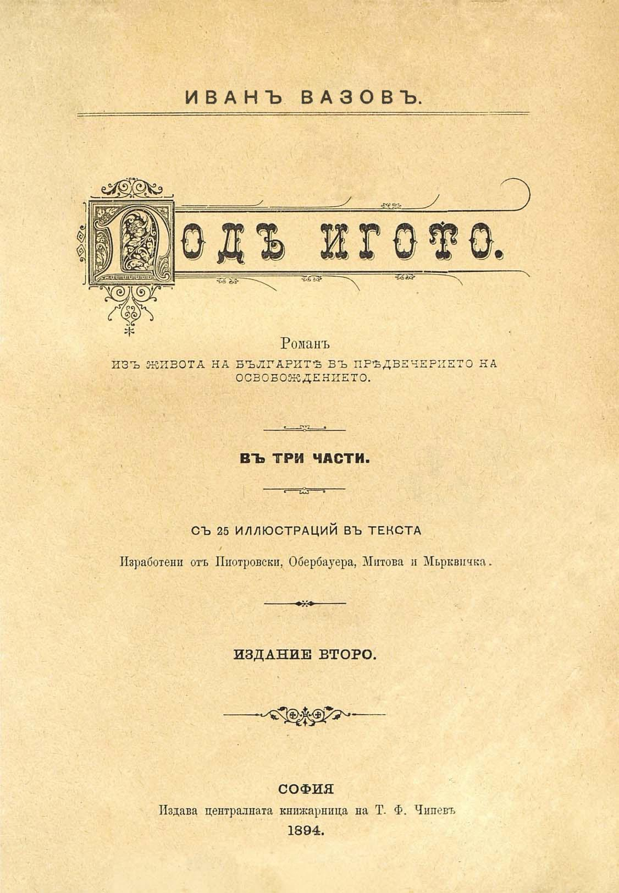

ИВАНЪ ВАЗОВЪ.

Подъ игото

Романъ

изъ живота на българитѣ въ прѣдвечерието на ОСВОБОЖДЕНИЕТО.

ВЪ ТРИ ЧАСТИ

СЪ 25 ИЛЛЮСТРАЦИЙ ВЪ ТЕКСТА

Пзработени отъ Пиотровски, Обербауера, Митова и Мьрквичка.

ИЗДАНИЕ ВТОРО.

СОФИЯ

Издава централната книжарница на Т. Ф. Чипевъ

1894\.

