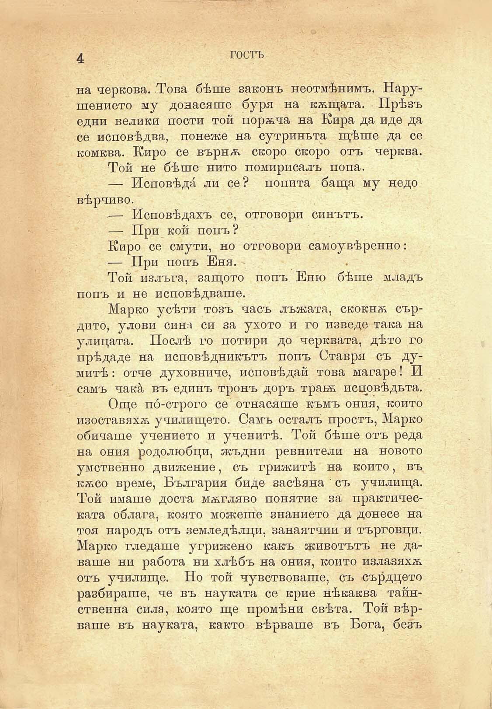

г

4

гостъ

на черкова. Това бѣше законъ неотмѣнимъ. Нарушението му донасяше буря на кѫщата. Прѣзъ едни велики пости той порѫча на Кира да иде да се исповѣдва, понеже на сутриньта щѣше да се комква. Киро се върнѫ скоро скоро отъ черква.

Той не бѣше нито помирисалъ попа.

— Исповѣд4 ли се? попита баща му недо вѣрчиво.

— Изповѣдахъ се, отговори синътъ.

— При кой попъ?

Киро се смути, но отговори самоувѣренно:

— При попъ Еня.

Той излъга, защото попъ Еню бѣше младъ попъ и не исповѣдваше.

Марко усѣти тозъ часъ лъжата, скокнѫ сърдито, улови сини си за ухото и го изведе така на улицата. Послѣ го потири до черквата, дѣто го прѣдаде на исповѣдникътъ попъ Ставря съ думитѣ : отче духовниче, исповѣдай това магаре! И самъ чакѝ въ единъ тронъ доръ траьь исповѣдьта.

Още по́-строго се отнасяше къмъ ония, който изоставяхѫ училището. Самъ осталъ простъ, Марко обичаше учението и ученитѣ. Той бѣше отъ реда на ония родолюбци, жъдни ревнители на новото умственно движение, съ грижитѣ на който, въ кѫсо време, България биде засѣяна съ училища. Той имаше доста мѫгляво понятие за практическата облага, която можеше знанието да донесе на тоя народъ отъ земледѣлци, занаятчии и търговци. Марко гледаше угрижено какъ животътъ не даваше ни работа ни хлѣбъ на ония, който излазяхѫ отъ училище. Но той чувствоваше, съ сърдцето разбираше, че въ науката се крие нѣкаква тайнственна сила, която ще промѣни свѣта. Той вѣрваше въ науката, както вѣрваше въ Бога, безъ

