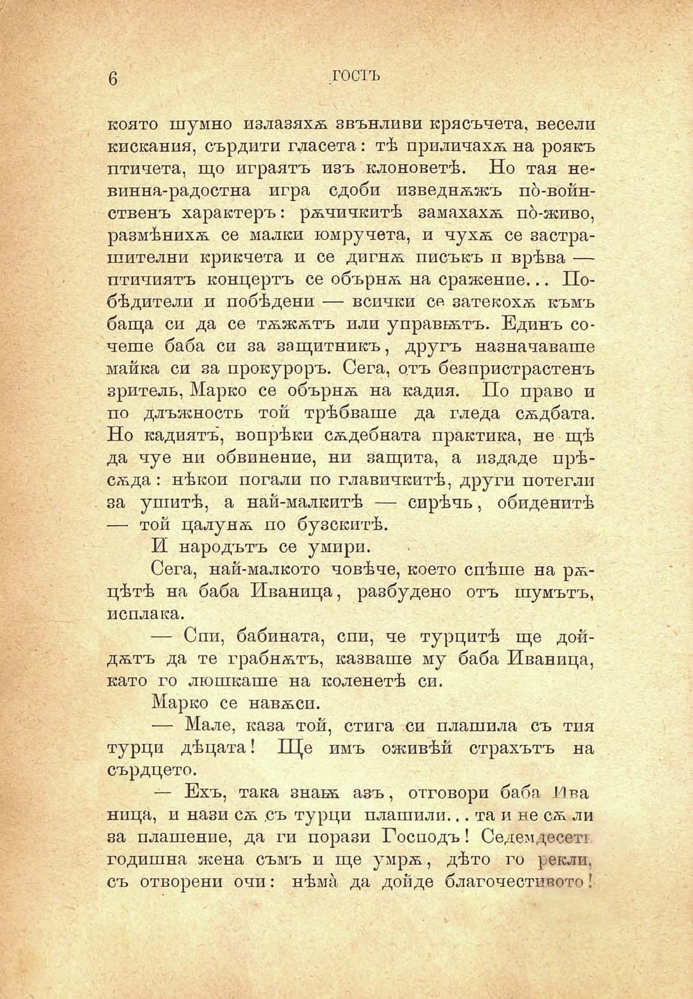

6

гостъ

която шумно излазяхѫ звънливи крясъчета, весели кискания, сърдити гласета: тѣ приличахѫ на роякъ птичета, що играятъ изъ клоноветѣ. Но тая невинна-радостна игра сдоби изведнѫжъ по́-войнственъ характеръ: рѫчичкитѣ замахахѫ пд-живо, размѣнихѫ се малки юмручета, и чухѫ се застра-шителни крикчета и се дигнѫ писъкъ и врѣва — птичиятъ концертъ се обърнѫ на сражение... Побѣдители и побѣдени — всички се затекохѫ къмъ баща си да се тѫжѫтъ или у правистъ. Единъ сочеше баба си за защитникъ, другъ назначаваше майка си за прокуроръ. Сега, отъ безпристрастенъ зритель, Марко се обърнѫ на кадия. По право и по длъжность той трѣбваше да гледа сѫдбата. Но кадиятъ, вопрѣки сѫдебната практика, не щѣ да чуе ни обвинение, ни защита, а издаде прѣсѫда: нѣкои погали по главичкитѣ, други потегли за ушитѣ, а най-малкитѣ — сирѣчь, обиденитѣ — той цалунѫ по бузскитѣ.

И народътъ се умири.

Сега, най-малкото човѣче, което спѣше на рѫцѣтѣ на баба Иваница, разбудено отъ шумътъ, поплака.

— Спи, бабината, спи, че турцитѣ ще дойдѫтъ да те грабнѫтъ, казваше му баба Иваница, като го люшкаше на коленетѣ си.

Марко се навѫси.

— Мале, каза той, стига си плашила съ тия турци дѣцата! Ще имъ оживѣй страхътъ на сърдцето.

— Ехъ, така знахѫ азъ, отговори баба Лва Ница, и нази сѫ съ турци плашили... та и не сѫ ли за плашение, да ги порази Господъ! Седемдесетт годишна жена съмъ и ще умрѫ, дѣто го рекли, съ отворени очи: нѣма да дойде благочестивото!

