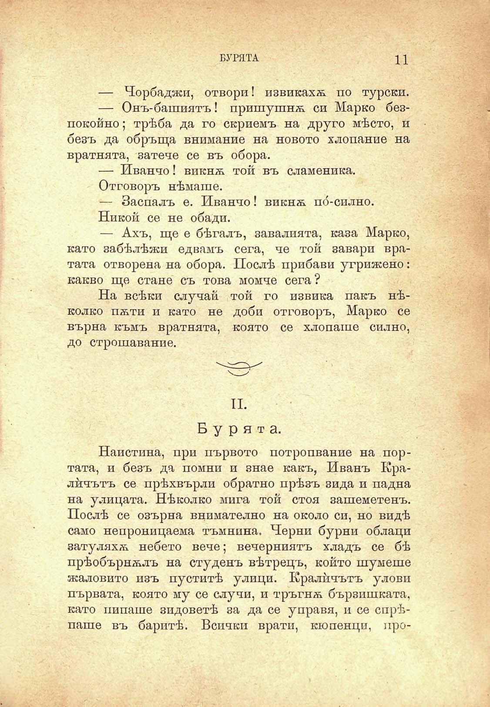

БУРЯТА

11

— Чорбаджи, отвори! извикахѫ по турски.

— Онъ-башиятъ! пришушнѫ си Марко безпокойно; трѣба да го скриемъ на друго мѣсто, и безъ да обръща внимание на новото хлопание на вратнята, затече се въ обора.

— Иванчо! викнѫ той въ сламеника.

Отговоръ нѣмаше.

— Заспалъ е. Иванчо! викнѫ по́-силно.

Никой се. не обади.

— Ахъ, ще е бѣгалъ, завалията, каза Марко, като забѣлѣжи едвамъ сега, че той завари вратата отворена на обора. Послѣ прибави угрижено: какво ще стане съ това момче сега?

На всѣки случай той го извика пакъ нѣколко пѫти и като не доби отговоръ, Марко се върна къмъ вратнята, която се хлопаше силно, до строшавание.

II.

Бурята.

Наистина, при първото потропвание на портата, и безъ да помни и знае какъ, Иванъ Кралйчътъ се прѣхвърли обратно прѣзъ зида и падна на улицата. Нѣколко мига той стоя зашеметенъ. Послѣ се озърна внимателно на около си, но видѣ само непроницаема тъмнина. Черни бурни облаци затуляхѫ небето вече; вечерниятъ хладъ се бѣ прѣобърнѫлъ на студенъ вѣтрецъ, който шумете жаловито изъ пуститѣ улици. Кралйчътъ улови първата, която му се случи, и тръгнѫ бързишката, като пипаше зидоветѣ за да се управя, и се спрѣпаше въ баритѣ. Всички врати, кюпенци, про

