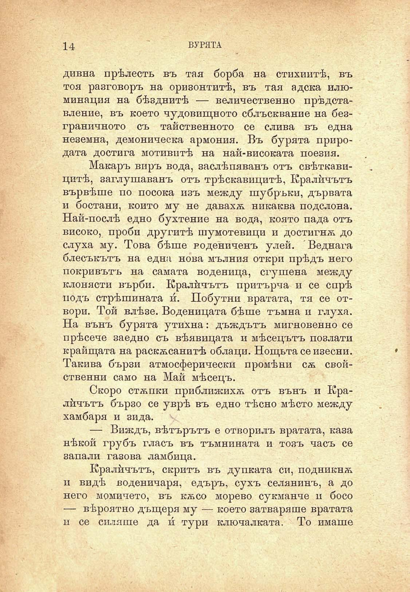

14

БУРЯТА

дивна прѣлесть въ тая борба на стихиитѣ, въ тоя разговоръ на оризонтитѣ, въ тая адска илюминация на бѣзднитѣ — величественно прѣдставление, въ което чудовищното сблъсквание на безграничното съ тайственното се слива въ една неземна, демоническа армония. Въ бурята природата достига мотивитѣ на най-високата поезия.

Макаръ виръ вода, заслѣпяванъ отъ свѣткавицитѣ, заглушаванъ отъ трѣскавицитѣ, Кралйчътъ вървѣше по посока изъ между шубръки, дървата и бостани, който му не давахѫ никаква подслона. Най-послѣ едно бухтение на вода, която пада отъ високо, проби другитѣ шумотевици и достигнѫ до слуха му. Това бѣше водениченъ улей. Веднага блесъкътъ на една нова мълния откри прѣдъ него покривътъ на самата воденица, сгушена между клонясти върби. Кралйчътъ притърча и се спрѣ подъ стрѣшината и́. Побутни вратата, тя се отвори. Той влѣзе. Воденицата бѣше тъмна и глуха. На вънъ бурята утихна: дъждътъ мигновенно се прѣсече заедно съ вѣявицата и мѣсецътъ позлати крайщата на раскѫсанитѣ облаци. Нощьта сеизесни. Такива бързи атмосферически промѣни сѫ свойствений само на Май мѣсецъ.

Скоро стѫпки приближихѫ отъ вънъ и Кралйчътъ бързо се уврѣ въ едно тѣсно мѣсто между хамбари и зида.

— Виждъ, вѣтърътъ е отворилъ вратата, каза нѣкой грубъ гласъ въ тъмнината и тозъ часъ се запали газова ламбица.

Кралйчътъ, скритъ въ дупката си, подникнѫ и видѣ воденичаря, едъръ, сухъ селянинъ, а до него момичето, въ кѫсо морево сукманче и босо — вѣроятно дъщеря му — което затваряше вратата и се силяше да и́ тури ключалката. То имаше

