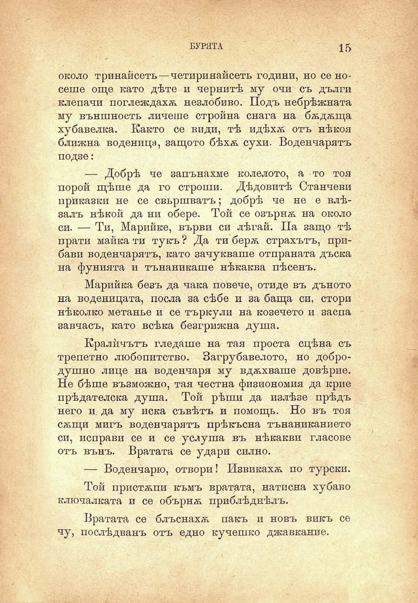

БУРЯТА

15

около тринайсеть—четиринайсеть години, но се носете още като дѣте и чернитѣ му очи съ дълги клепачи поглеждахѫ незлобиво. Подъ небрѣжната му външность личеше стройна снага на бѫдѫща хубавелка. Както се види, тѣ идѣхѫ отъ нѣкоя ближна воденица, защото бѣхѫ сухи. Воденчарятъ подзе:

— Добрѣ че запънахме колелото, а то тоя порой щѣше да го строши. Дѣдовитѣ Станчеви приказки не се свьршватъ; добрѣ че не е влѣзалъ нѣкой да ни обере. Той се озърнѫ на около си. — Ти, Марийке, върви си лѣгай. Па защо тѣ прати майка ти тукъ? Да ти берѫ страхътъ, прибави воденчарятъ, като зачукваше отпраната дъска на фунията и тънаникаше нѣкаква пѣсенъ.

Марийка безъ да чака повече, отиде въ дъното на воденицата, поела за сѣбе и за баща си, стори нѣколко метанье и се търкули на козечето и заспа завчасъ, като всѣка безгрижна душа.

Кралйчътъ гледаше на тая проста сцѣна съ трепетно любопитство. Загрубавелото, но добродушно лице на воденчаря му вдѫхваше довѣрие. Не бѣше възможно, тая честна физиономия да крие прѣдателска душа. Той рѣши да излѣзе прѣдъ него и. да му иска съвѣтъ и помощь. Но въ тоя сѫщи мигъ воденчарятъ прѣкъсна тънаниканието си, неправи се и се услуша въ нѣкакви гласове отъ вънъ. Вратата се удари силно.

— Воденчарю, отвори! Извикахѫ по турски.

Той пристѫпи къмъ вратата, натисна хубаво ключалката и се обърнѫ приблѣднѣлъ.

Вратата се блъснахѫ пакъ и новъ викъ се чу, послѣдванъ отъ едно кучешко джавкание.

