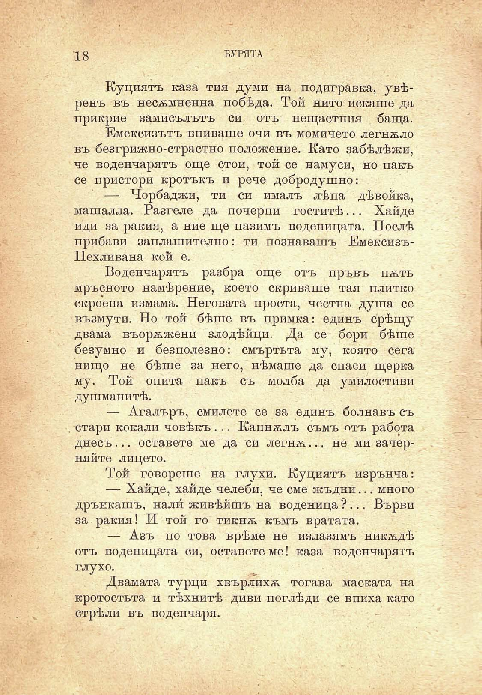

18

БУРЯТА

Куциятъ каза тия думи на. подигравка, увѣренъ въ несѫмненна побѣда. Той нито искаше да прикрие замисълътъ си отъ нещастния баща.

Емексизътъ впиваше очи въ момичето легнѫло въ безгрижно-страстно положение. Като забѣлѣжи, че воденчарятъ още стои, той се намуси, но пакъ се пристори кротъкъ и рече добродушно:

— Чорбаджи, ти си ималъ лѣпа дѣвойка, машалла. Разгеле да почерпи гоститѣ... Хайде иди за ракия, а ние ще пазимъ воденицата. Послѣ прибави заплашително: ти познавашъ ЕмексизъПехливана кой е.

Воденчарятъ разбра още отъ пръвъ пѫть мръсното намѣрение, което скриваше тая плитко скроена измама. Неговата проста, честна душа се възмути. Но той бѣше въ примка: единъ срѣщу двама въорѫжени злодѣйци. Да се бори бѣше безумно и безполезно: смъртьта му, която сега нищо не бѣше за него, нѣмаше да спаси щерка му. Той опита пакъ съ молба да умилостиви душманитѣ.

— Агалъръ, смилете се за единъ болнавъ съ стари кокали човѣкъ ... Капнѫлъ съмъ лтъ работа днесъ... оставете ме да си легнѫ... не ми зачерняйте лицето.

Той говореше на глухи. Куциятъ изрънча:

— Хайде, хайде челеби, че сме жъдни... много дрънкашъ, нали́ живѣйшъ на воденица ?... Върви за ракия! И той го тикнѫ къмъ вратата.

— Азъ по това врѣме не излавямъ никѫдѣ отъ воденицата си, оставете ме! каза воденчарятъ глухо.

Двамата турци хвърлихѫ тогава маската на кротостьта и тѣхнитѣ диви поглѣди се впиха като стрѣли въ воденчаря.

