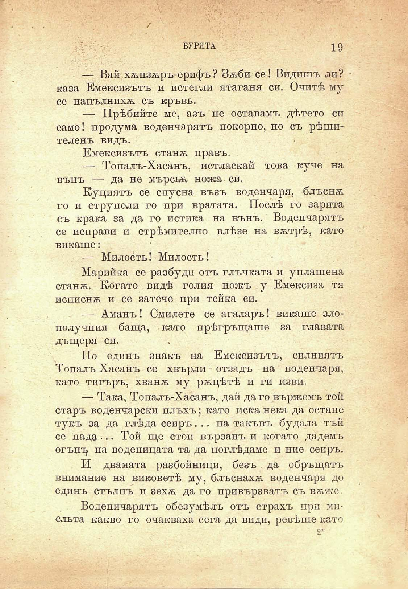

БУРЯТА	19

— Вай хѫнзѫръ-ерифъ ? Зѫби се! Видишъ ли? • каза Емексизътъ и истегли ятагани си. Очитѣ му се напълнихѫ съ кръвь.

— Прѣбийте ме, азъ не оставамъ дѣтето си само! продума воденчарятъ покорно, но съ рѣшителенъ видъ.

Емексизътъ станѫ правъ.

— Топалъ-Хаса́нъ, истласкай това куче на вънъ — да не мъреьѫ ножа си.

Куциятъ се спусна възъ воденчаря, блъснѫ го и струполи го при вратата. Послѣ го зарита съ крака за да го истика на вънъ. Воденчарятъ се неправи и стрѣмително влѣзе на вѫтрѣ, като викаше:

— Милость! Милость !

Марийка се разбуди отъ глъчката и уплашена станѫ. Когато видѣ голия ножъ у Емексиза тя исписнѫ и се затече при тейка си.

— Аманъ! Смилете се агаларъ! викаше злополучния баща, като прѣгръщаше за главата дъщеря си.

По единъ знакъ на Емексизътъ, силниятъ Тепалъ Хасанъ се хвърли отзадъ на воденчаря, като тигъръ, хванѫ му рѫцѣтѣ и ги изви.

— Така, Топалъ-Хасанъ, дай да го вържемъ той старъ воденчарски плъхъ; като пека нека да остане тукъ за да глѣда сеиръ. .. на такъвъ будала тъй се пада •.. Той ще стои вързанъ и когато дадемъ огънъ на воденицата та да поглѣдаме и ние сеиръ.

И двамата разбойници, безъ . да обръщатъ внимание на виковетѣ му, блъснахѫ воденчаря до единъ стълпъ и зехѫ да го привързватъ съ вѫже.

Воденичарятъ обезумѣлъ отъ страхъ при мисльта какво го очакваха сега да види, ревѣше като

