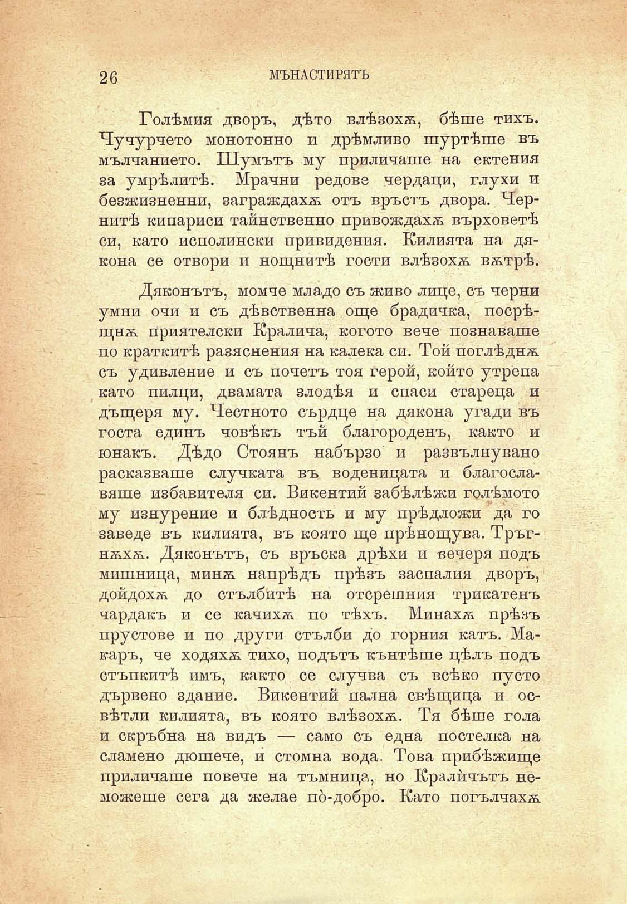

26

МЪНАСТИРЯТЪ

Голѣмия дворъ, дѣто влѣзохѫ, бѣше тихъ. Чучурчето монотонно и дрѣмливо шуртѣше въ мълчанието. Шумътъ му приличаше на ектения за умрѣлитѣ. Мрачни редове чердаци, глухи и безжизнений, заграждахѫ отъ връстъ двора. Чернитѣ кипариси тайнственно привождахѫ върховетѣ си, като исполински привидения. Килията на дякона се отвори и нощнитѣ гости влѣзохѫ вѫтрѣ.

Дяконътъ, момче младо съ живо лице, съ черни умни очи и съ дѣвственна още брадичка, посрѣщнѫ приятелски Кралича, когото вече познаваше по краткитѣ разяснения на калека си. Той поглѣднѫ съ удивление и съ почетъ тоя герой, който утрепа като пилци, двамата злодѣя и спаси стареца и дъщеря му. Честното сърдце на дякона угади въ госта единъ човѣкъ тъй благороденъ, както и юнакъ. Дѣдо Стоянъ набързо и развълнувано расказваше случката въ воденицата и благославяше избавителя си. Викентий забѣлѣжи голѣмото му изнурение и блѣдность и му прѣдложи да го заведе въ килията, въ която ще прѣнощува. Тръгнѫхѫ. Дяконътъ, съ връска дрѣхи и вечеря подъ мишница, минѫ напрѣдъ прѣзъ заспалия дворъ, дойдохѫ до стълбитѣ на отсрешния трикатенъ чардакъ и се качихѫ по тѣхъ. Минахѫ прѣзъ прустове и по други стълби до горния катъ. Макаръ, че ходяхѫ тихо, подътъ кънтѣше цѣлъ подъ стъпкитѣ имъ, както се случва съ всѣко пусто дървено здание. Викентий пална свѣщица и освѣтли килията, въ която влѣзохѫ. Тя бѣше гола и скръбна на видъ — само съ една постелка на сламено дюшече, и стомна вода. Това прибѣжище приличаше повече на тъмница, но Кралйчътъ неможеше сега да желае по́-добро. Като погълчахѫ

