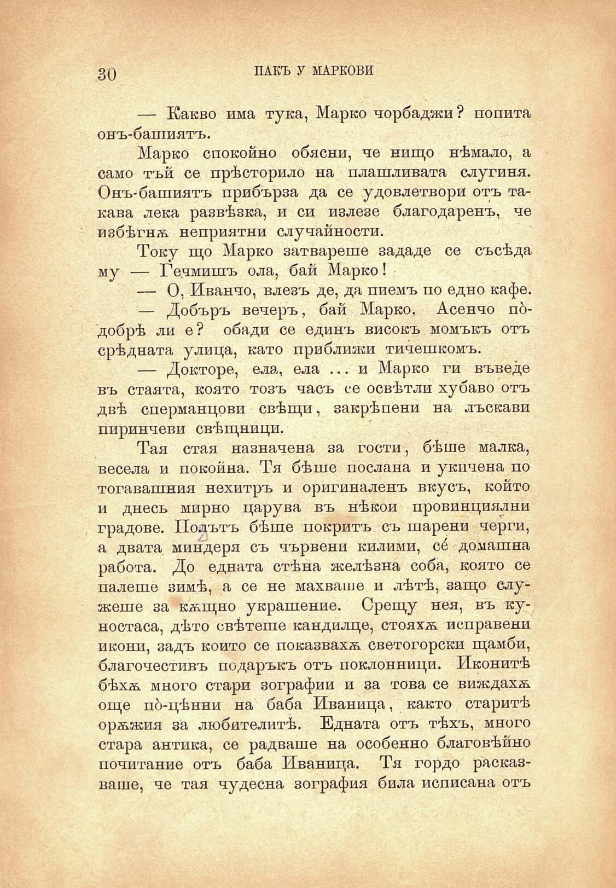

30

ПАКЪ У МАРКОВИ

— Какво има тука, Марко чорбаджи? попита онъ-башиятъ.

Марко спокойно обясни, че нищо нѣмало, а само тъй се прѣсторило на плашливата слугиня. Онъ-башиятъ прибърза да се удовлетвори отъ такава лека развѣзка, и си излезе благодаренъ, че избѣгнѫ неприятни случайности.

Току що Марко затвареше зададе се съсѣда му — Гечмишъ ола, бай Марко!

— О, Иванчо, влезъ де, да пиемъ по едно кафе.

— Добъръ вечеръ, бай Марко. Асенчо по́добрѣ ли е? обади се единъ високъ момъкъ отъ срѣдната улица, като приближи тичешкомъ.

— Докторе, ела, ела ... и Марко ги въведе въ стаята, която тозъ часъ се освѣтли хубаво отъ двѣ сперманцови свѣщи, закрѣпени на лъскави пиринчеви свѣщници.

Тая стая назначена за гости, бѣше малка, весела и покойна. Тя бѣше послана и укичена по тогавашния нехитръ и оригиналенъ вкусъ, който и днесъ мирно царува въ нѣкои провинциялни градове. Полътъ бѣше покритъ съ шарени черги, а двата миндеря съ чървени килими, со́ домашна работа. До едната стѣна желѣзна соба, която се палете зимѣ, а се не махваше и лѣтѣ, защо служеше за кѫщно украшение. Срещу нея, въ куностаса, дѣто свѣтете кандилце, стояхѫ исправени икони, задъ който се показвахѫ светогорски щамби, благочестивъ подаръкъ отъ поклонници. Иконитѣ бѣхѫ много стари зографии и за това се виждахѫ още по́-цѣнни на баба Иваница, както старитѣ орѫжия за любителитѣ. Едната отъ тѣхъ, много стара антика, се радваше на особенно благовѣйно почитание отъ баба Иваница. Тя гордо расказваше, че тая чудесна зография била неписана отъ

