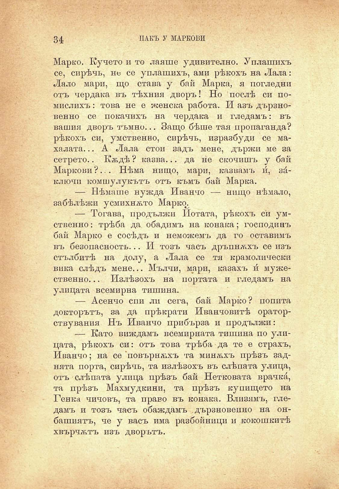

34

ПАКЪ У МАРКОВИ

Марко. Кучето и то лаяше удивително. Уплашихъ се, сирѣчь, не се уплашихъ, ами рѣкохъ на Лала: Лало мари, що става у бай Марка, я погледни отъ чердака въ тѣхния дворъ! Но послѣ си помислихъ : това не е женска работа. И азъ дързновенно се покачихъ на чердака и гледамъ: въ вашия дворъ тъмно... Защо бѣше тая пропаганда? рѣкохъ си, умственно, сирѣчь, изразбуди се махалата... А Лала стои задъ мене, държи ме за сетрето.. Кѫдѣ ? казва... да не скочишъ у бай Маркови ?... Нѣма нищо, мари, казвамъ и́, заключи комшулукътъ отъ къмъ бай Марка.

— Нѣмаше нужда Иванчо — нищо нѣмало, забѣлѣжи усмихнѫто Марксъ

— Тогава, продължи Нотата, рѣкохъ си умственно : трѣба да обадимъ на конака; господинъ бай Марко е сосѣдъ и неможемъ да го оставимъ въ безопасность... И тозъ часъ дръпнѫхъ се изъ стълбитѣ на долу, а Лала се тя крамолически вика слѣдъ мене... Мълчи, мари, казахъ и́ мужественно... Излѣзохъ на портата и гледамъ на улицата всемирна тишина.

— Асенчо спи ли сега, бай Марко? попита докторътъ, за да прѣкрати Иванчовитѣ ораторствувания Нъ Иванчо прибърза и продължи:

— Като виждамъ всемирната тишина по улицата, рѣкохъ си: отъ това трѣба да те е страхъ, Иванчо; на се повърнѫхъ та минѫхъ прѣзъ заднята порта, сирѣчь, та излѣзохъ въ слѣпата улица, отъ слѣпата улица прѣзъ бай Нетковата врачки́, та прѣзъ Махмудкини, та прѣзъ купището на Генка чичовъ, та право въ конака. Влизамъ, гледамъ и тозъ часъ обаждамъ дързновенно на онбашиятъ, че у васъ има разбойници и кокошкитѣ

хвърчѫтъ изъ дворътъ.

