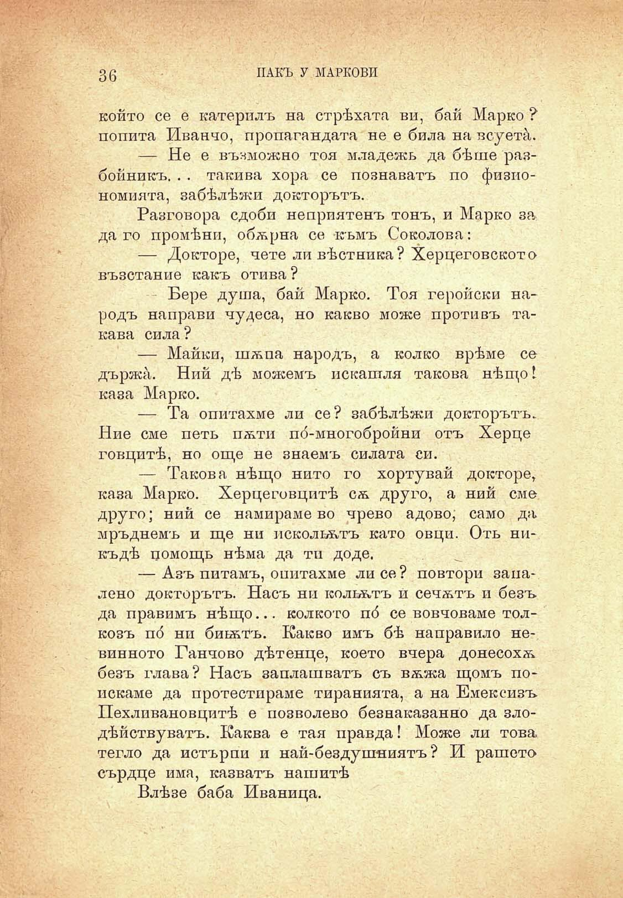

36

ПАКЪ У МАРКОВИ

който се е катерилъ на стрѣхата ви, бай Марко ? попита Иванчо, пропагандата не е била на всуетѝ.

— Не е възможно тоя младежь да бѣше разбойникъ. . . такива хора се познаватъ по физиономията, забѣлѣжи докторътъ.

Разговора сдоби неприятенъ тонъ, и Марко за да го промѣни, обѫрна се къмъ Соколова:

— Докторе, чете ли вѣстника? Херцеговското възстание какъ отива ?

Бере душа, бай Марко. Тоя геройски народъ направи чудеса, но какво може противъ такава сила?

— Майки, шѫпа народъ, а колко врѣме се държа. Ний дѣ можемъ покашля такова нѣщо I каза Марко.

— Та опитахме ли се? забѣлѣжи докторътъ. Ние сме петь пѫти по́-многобройни отъ Херце говцитѣ, но още не знаемъ силата си.

— Такова нѣщо нито го хортувай докторе, каза Марко. Херцеговцптѣ сѫ друго, а ний сме друго; ний се намираме во чрево адово; само да» мръднемъ и ще ни искольѫтъ като овци. Отъ никъдѣ помощь нѣма да ти до де.

— Азъ питамъ, опитахме ли се ? повтори запалено докторътъ. Насъ ни кольѫтъ и сечѫтъ и безъ да правимъ нѣщо... колкото по́ се вовчоваме толкозъ по́ ни биьѫтъ. Какво имъ бѣ направило невинното Ганчово дѣтенце, което вчера донесохѫ безъ глава? Насъ заплашватъ съ вѫжа щомъ поискаме да протестираме тиранията, а на Емексизъ Пехливановцитѣ е позволево безнаказанно да злодѣйствуватъ. Каква е тая правда! Може ли това тегло да потърпи и най-бездушниятъ ? И рашето сърдце има, казватъ нашитѣ

Влѣзе баба Иваница.

