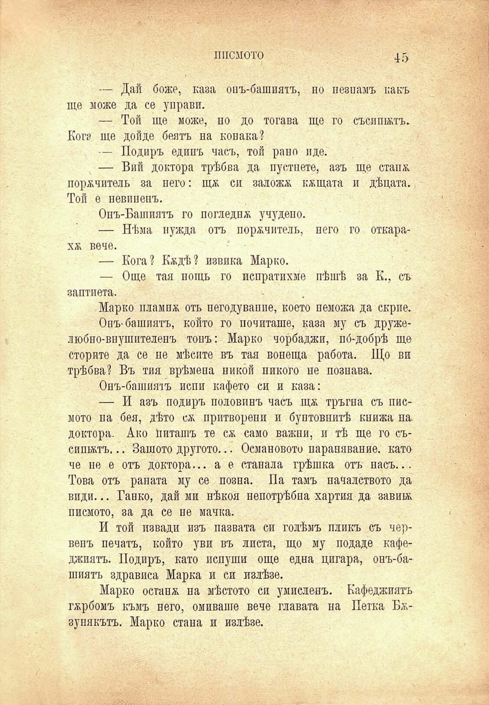

писмото

45

— Дай боже, каза опъ-башиятъ, но пезпамъ какъ ще може да се управи.

— Той ще може, но до тогава ще го съсипятъ. Кога ще дойде беятъ на конака?

— Подиръ единъ часъ, той рано иде.

— Вий доктора трѣбва да пустпете, азъ ще стапя, порѫчитель за него: щя си заложа кжщата и дѣцата. Той е невиненъ.

Опъ-Башиятъ го погледна учудено.

— Нѣма нужда отъ порѫчитель, пего го откарахя вече.

— Кога? Кждѣ? извика Марко.

— Още тая поть го испратихме пѣшѣ за К., съ заптиета.

Марко плампж оть пегодуваппе, което пеможа да скрие.

Онъ-башиятъ, който го почиташе, каза му съ дружелюбно-впушителенъ тонъ: Марко чорбаджи, по́-добрѣ ще сторите да се не мѣсите въ тая вонеща работа. Що ви трѣбва? Въ тия врѣмена никой никого не познава.

Онъ-башия'1ъ испи кафето си и каза:

— И азъ подиръ половинъ часъ щж тръгна съ писмото па бея, дѣто сж притворени и бунтовнитѣ книжа на. доктора. Ако Питашъ те сж само важни, и тѣ ще го съсишжтъ... Защото другото... Османовото парапявание. като че не е отъ доктора... а е ставала грѣшка отъ насъ... Това отъ раната му се позна. Па тамъ началството да види... Гайко, дай ми нѣкоя непотрѣбна хартия да завива писмото, за да се не мачка.

И той извади изъ пазвата си голѣмъ пликъ съ червепъ печатъ, който уви въ листа, що му подаде кафеджиятъ. Подиръ, като ислуши още една цигара, онъ-башиятъ здрависа Марка и си излѣзе.

Марко оставя на мѣстото си умисленъ. Кафеджиятъ гхрбомъ къмъ него, омиваше вече главата на Петка Бязунякътъ. Марко стана и излѣзе.

