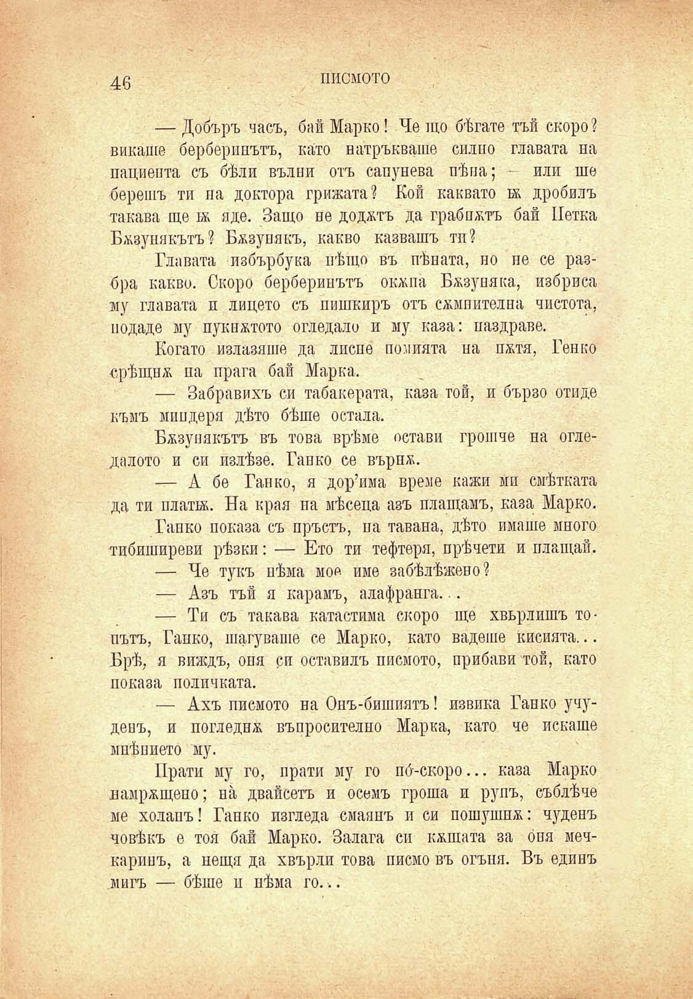

46

писмото

— Добъръ часъ, бай Марко! Че що бѣгате тъй скоро? викаше берберинътъ, като натръкваше силно главата на пациента съ бѣли вълни отъ сапунева пѣна; - или ше берешъ ти па доктора грижата? Кой каквато ѭ дробилъ такава ще въ яде. Защо не доджтъ да грабнатъ бай Петка Бжзунякътъ? Бжзупякъ, какво казвашъ тп?

Главата пзбърбука нѣщо въ пѣната, но не се разбра какво. Скоро берберинътъ окжпа Бжзупяка, избриса му главата и лицето съ пишкиръ отъ съмнителна чистота, подаде му пукнътото огледало и му каза: наздраве.

Когато излавяше да лисне помията на пжтя, Генко срѣщи ѭ па прага бай Марка.

— Забравихъ си табакерата, каза той, и бързо отиде къмъ миндери дѣто бѣше остала.

Бжзупякътъ въ това врѣме остави грошче па огледалото и си излѣзе. Гайко се върпж.

— А бе Гайко, я дор’има време кажи ми смѣтката да ти плати. На края па мѣсена азъ плащамъ, каза Марко.

Гайко показа съ пръстъ, на тавана, дѣто имаше много тибиширеви рѣзки: — Ето ти тефтери, прѣчети и плащай.

— Че тукъ нѣма мое име забѣлѣжено?

— Азъ тъй я карамъ, алафранга...

— Ти съ такава катастима скоро ще хвърлишъ топътъ, Гайко, шагуваше се Марко, като вадете кисията... Брѣ, я виждъ, опя си оставилъ писмото, прибави той, като показа поличката.

— Ахъ писмото на Онъ-бишиятъ! извика Гайко учуденъ, и погледна въпросително Марка, като че искаше мнѣпието му.

Прати му го, прати му го по́-скоро... каза Марко намръщено; на двайсеть и осемь гроша и рупъ, съблѣче ме холанъ! Гапко изгледа смаянъ и си пошушпъ: чуденъ човѣкъ е тоя бай Марко. Залага си къшата за оня мечкаринъ, а нещя да хвърли това писмо въ огъня. Въ единъ мигъ — бѣше и нѣма го...

