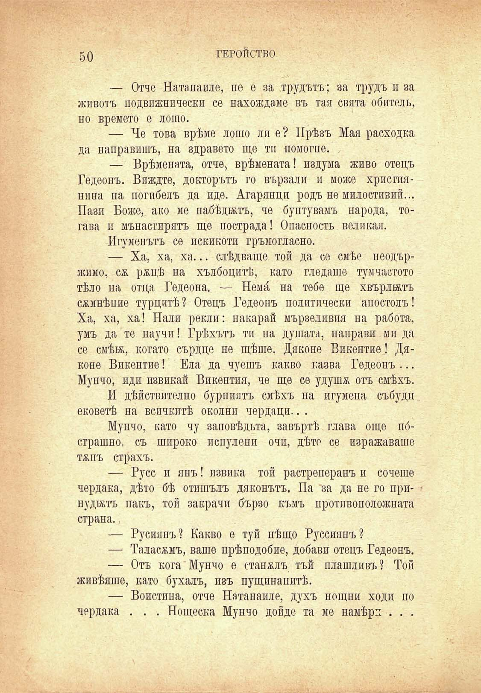

50

ГЕРОЙСТВО

— Отче Натапаиле, не е за трудътъ; за трудъ и за животъ подвижи и чески се нахождаме въ тая свята обитель, но Бремето е лодю.

— Че това врѣме лошо ли е? Прѣзъ Мая расходка да направишъ, на здравето ще ти помогне.

— Врѣмената, отче, врѣмената! издума живо отецъ Гедеонъ. Впждте, докторътъ го вързали и може християнина на погибелъ да иде. Агарянци родъ не милостивий... Пази Боже, ако ме пабѣджтъ, че бунтувамъ народа, тогава и мънастирятъ ще пострада! Опасность великая.

Игуменътъ се искикоти гръмогласно.

— Ха, ха, ха... слѣдваше той да се смѣе неодържимо, сж ржцѣ па хълбоцитѣ, като гледаше тум наетото тѣло на отца Гедеона. — Немй на тебе ще хвърлятъ сжмнѣпие турцитѣ? Отецъ Гедеонъ политически апостолъ! Ха, ха, ха! Нали рекли: накарай мързеливия на работа, умъ да те научи! Грѣхътъ тп на душата, направи ми да се смѣж, когато сърдце не щѣше. Дяконе Викентие! Дяконе Викентие! Ела да чуешъ какво казва Гедеонъ ... Мунчо, иди извикай Викептия, че ще се удушж отъ смѣхъ.

И дѣйствително бурниятъ смѣхъ на игумена събуди ековетѣ на всичкитѣ околни чердаци.. .

Мунчо, като чу заповѣдьта, завъртѣ глава още пбстрашпо, съ широко испулени очи, дѣто се изражаваше тжпъ страхъ.

— Русе и янъ! извика той растреперанъ и сочеше чердака, дѣто бѣ отишълъ дяконътъ. Па за да не го при- • нуджтъ пакъ, той закрачи бързо къмъ протпвоположната страна.

— Русиянъ? Какво е туй нѣщо Руссиянъ?

— Таласъмъ, ваше прѣподобие, добави отецъ Гедеонъ.

— Отъ кога Мунчо е станжлъ тъй плашливъ? Той живѣяше, като бухалъ, изъ пущина питѣ.

— Воистина, отче Натанаиле, духъ нощни ходи по чердака . . . Нощеска Мунчо дойде та ме намѣри . . .

