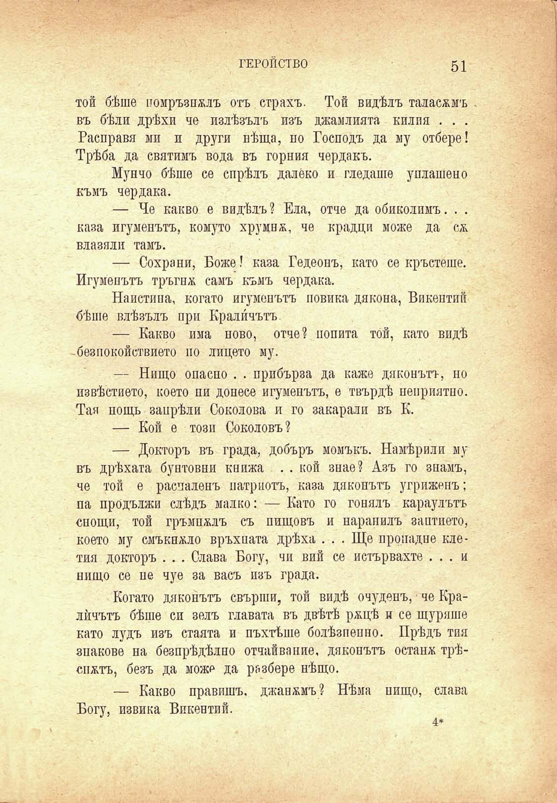

ГЕРОЙСТВО	51

той бѣше помръзналъ отъ страхъ. Той видѣлъ таласъмъ въ бѣли дрѣхи че излѣзълъ изъ джамлията килия . . . Расправя ми и други вѣща, по Господъ да му отбере! Трѣба да святимъ вода въ горния чердакъ.

Мунчо бѣше се спрѣлъ далеко и гледаше уплашено къмъ чердака.

— Че какво е видѣлъ? Ела, отче да обиколимъ. . . каза игуменътъ, комуто хрумна, че крадци може да сж вдавали тамъ.

— Сохрани, Боже! каза Гедеонъ, като се кръстеше. Игуменътъ тръгна самъ къмъ чердака.

Наистина, когато игуменътъ повика дякона, Викентий бѣше влѣзълъ при Кралйчътъ.

— Какво има ново, отче? попита той, като видѣ -безпокойствието по лицето му.

— Нищо опасно . . прибърза да каже дяконътъ, но извѣстието, което пи донесе игуменътъ, е твърдѣ неприятно. Тая пощь запрѣли Соколова и го закарали въ К.

— Кой е този Соколовъ?

— Докторъ въ града, добъръ момъкъ. Намѣрили му въ дрѣхата бунтовни книжа . . кой знае? Азъ го знамъ, че той е расчаленъ патриотъ, каза дяконътъ угриженъ; па продължи слѣдъ малко: — Като го гонялъ караулътъ снощи, той гръмналъ съ пищовъ и наранилъ заптието, което му смъквало връхната дрѣха . . . Ще пропадне клетия докторъ . . . Слава Богу, чи вий се истървахте ... и нищо се не чуе за васъ изъ града.

Когато дяконътъ свърши, той видѣ очудепъ, че Кралѝчътъ бѣше си зелъ главата въ двѣтѣ ржцѣ и се щураше като лудъ изъ стаята и пъхтѣше болѣзпенпо. Прѣдъ тия знакове на безпрѣдѣлно отчайва ние, дяконътъ остана трѣснатъ, безъ да може да разбере нѣщо.

— Какво правишъ, джанжмъ? Нѣма нищо, слава Богу, извика Викентий.

4*

