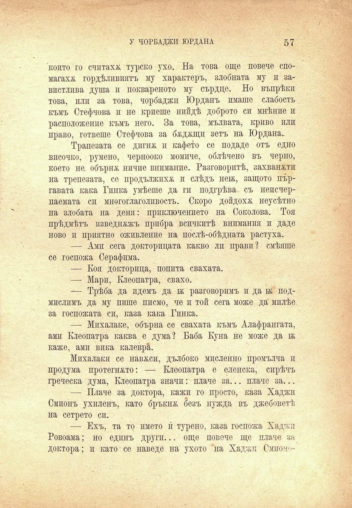

У ЧОРБАДЖИ ЮРДАНА

57

конто го считаха турско ухо. На това още ловене спомагахж гордѣливиятъ му характеръ, злобната му и завистлива душа и поквареното му сърдце. Но въпрѣки това, пли за това, чорбаджи Юрданъ имаше слабость къмъ Стефчова и не криеше нийдѣ доброто си мнѣнпе и расположенпе къмъ него. За това, мълвата, криво пли право, гответе Стефчова за бжджщп зетъ на Юрдана.

Трапезата се дигнж и кафето се подаде отъ едно височко, румено, чернооко момиче, облѣчено въ черно, което не. обърнж ничие внимание. Разговоритѣ, захванжти на трепезата, се продължихѫ и слѣдъ неьь, защото пъргавата кака Гинка умѣеше да ги подгрѣва съ непсчерпаемата си многоглаголпвость. Скоро дойдохѫ неусѣтно на злобата на деня: приключението на Соколова. Тоя прѣдмѣтъ изведнъжъ прибра всичкитѣ внимания и даде ново и приятно оживление на послѣ-обѣдната растуха.

— Ами сега докторицата какво ли прави? смѣяше се госпожа Серафима.

— Коя докторица, попита свахата.

— Мари, Клеопатра, свахо.

— Трѣба да идемъ да ек разговоримъ и да ѭ подмислимъ да му пише писмо, че и той сега може да милѣе за госпожата си, каза кака Гинка.

— Мпхалаке, обърна се свахата къмъ Алафрангата, ами Клеопатра каква е дума? Баба Куна не може да к каже, ами вика калевра.

Михалаки се навеси, дълбоко мислеино промълча п продума протегнато: — Клеопатра е еленска, сирѣлъ греческа дума, Клеопатра значи: плаче за... плаче за...

— Плаче за доктора, кажи го просто, каза Хаджи Смионъ ухиленъ, като бръкнж безъ нужда въ джобоветѣ на сетрето сп.

— Ехъ, та то името и турено, каза госпожа Хаджи Ровоама; но единъ други... още повече ще плаче за доктора; и като се наведе на ухото на Хаджи Смиот

