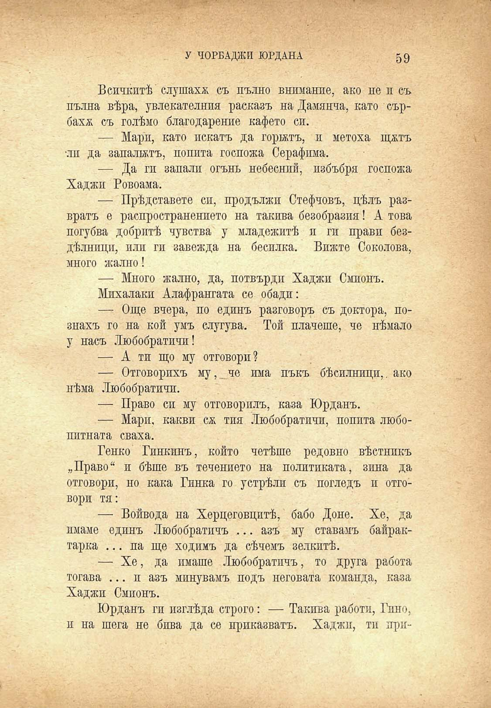

У ЧОРБАДЖИ ЮРДАНА	59

Всичкитѣ слушаха съ пълно внимание, ако не и съ пълна вѣра, увлекателния расказъ на Дамянча, като сърбаха съ голѣмо благодарение кафето си.

— Мари, като искатъ да горятъ, и метоха щжтъ •ли да запалятъ, попита госпожа Серафима.

— Да ги запали огънь небесний, избъбря госпожа Хаджи Ровоама.

— Прѣдставете си, продължи Стефчовъ, цѣлъ развратъ е распространението на такива безобразия! А това погубва добритѣ чувства у младежитѣ и ги прави бездѣлници, или ги завежда на бесилка. Вижте Соколова, зшого жално!

— Много жално, да, потвърди Хаджи Смионъ.

Михалаки Алафрангата се обади:

— Още вчера, по единъ разговоръ съ доктора, познахъ го на кой умъ слугува. Той плачеше, че нѣмало у насъ Любобратичи!

— А ти що му отговори?

— Отговорихъ му,_че има пъкъ бѣсилници,. ако нѣма Любобратичи.

— Право си му отговорилъ, каза Юрданъ.

— Мари, какви сж тия Любобратичи, попита любопитната снаха.

Генко Гинкинъ, който четѣше редовно вѣстникъ „Право“ и бѣше въ течението на политиката, зина да отговори, но кака Гинка го устрѣли съ погледъ и отговори тя:

— Войвода на Херцеговцитѣ, бабо Доне. Хе, да имаме единъ Любобратичъ ... азъ му ставамъ байрактарка ... па ще ходимъ да сѣчемъ зелкитѣ.

— Хе, да имаше Любобратичъ, то друга работа тогава ... и азъ минувачъ подъ неговата команда, каза Хаджи Смионъ.

Юрданъ ги изглѣда строго: — Такива работи, Гине, и на шега не бива да се приказватъ. Хаджи, ти при

