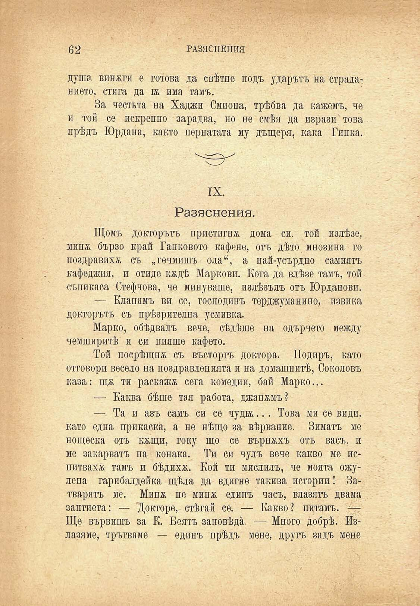

62	РАЗЯСНЕНИЯ

душа винаги е готова да свѣтне подъ ударътъ на страданието, стига да ѭ има тамъ.

За честьта на Хаджи Смиона, трѣбва да кажемъ, че и той се искрепно зарадва, но не смѣя да изрази4 това прѣдъ Юрдана, както пернатата му дъщеря, кака Гинка.

IX.

Разяснения.

Щомъ докторътъ пристигна дома си. той излѣзе, минж бързо край Танковото кафене, отъ дѣто мнозина го поздравихѫ съ „гечмишъ ода“, а най-усърдно самиятъ кафеджия, и отиде кадѣ Маркови. Кога да влѣзе тамъ, той съпикаса Стефчова, че минуваше, излѣзълъ отъ Юрданови.

— Кланямъ ви се, господинъ терджуманино, извика докторътъ съ прѣзрителна усмивка.

Марко, обѣдвалъ вече, сѣдѣше на одърчето между чемширитѣ и си нияше кафето.

Той посрѣщна съ въсторгъ доктора. Подиръ, като отговори весело на поздравленията и на домашнитѣ, Соколовъ каза:	ти раскажж сега комедии, бай Марко...

— Каква бѣше тая работа, джанжмъ?

— Та и азъ самъ си се чудж... Това ми се види, като една прикаска, а не нѣщо за вѣрвание. Зиматъ ме нощеска отъ кхщи, току що се върнжхъ отъ васъ, и ме закарватъ на конака. Ти си чулъ вече какво ме испитвахх тамъ и бѣдихж. Кой ти мислилъ, че моята ожулена гарибалдейка щѣла да вдигне такива истории! Затварятъ ме. Минж не минж единъ часъ, влазятъ двама заптиета: — Докторе, стѣгай се. — Какво? питамъ. — Ще вървишъ за К. Беятъ заповѣдѝ. — Много добрѣ. Излазяме, тръгваме — единъ прѣдъ мене, другъ задъ мене

■

