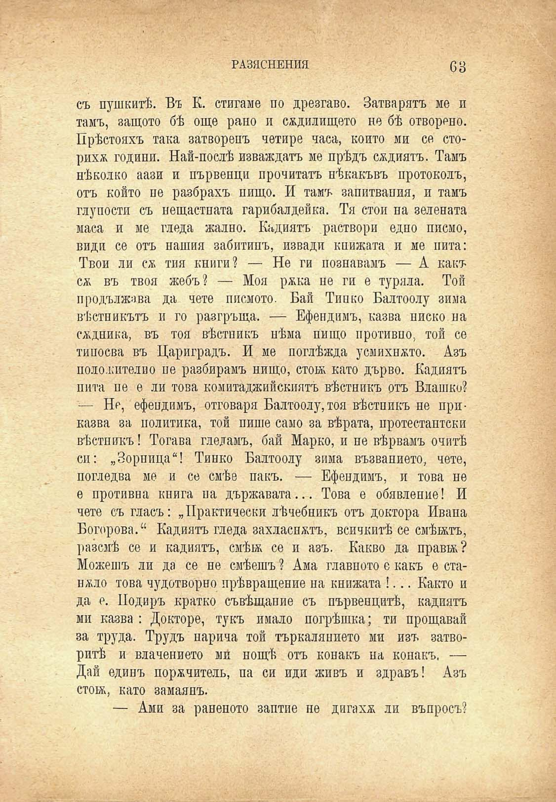

РАЗЯСНЕНИЯ	63

съ пушкитѣ. Въ К. стигаме по дрезгаво. Затварятъ ме и тамъ, защото бѣ още рано и сѫдилището не бѣ отворено. Прѣстояхъ така затворенъ четире часа, който ми се сторихж години. Най-послѣ изваждатъ ме прѣдъ сждиятъ. Тамъ нѣколко аази и първенци прочитатъ нѣкакъвъ протоколъ, отъ който пе разбрахъ нищо. И тамъ запитвания, и тамъ глупости съ нещастната гарибалдейка. Тя стои па зелената маса и ме гледа жално. Кадиятъ раствори едно писмо, види се отъ нашия забитипъ, извади книжата и ме пита: Твои ли сж тия книги? — Не ги познавамъ — А какъ сж въ твоя жебъ? — Моя р&ка не ги е туряла. Той продължава да чете писмото. Бай Тинко Балтоолу зима вѣстникътъ и го разгръща. — Ефендимъ, казва ниско на сѫдника, въ тоя вѣстникъ нѣма нищо противно, той се типосва въ Цариградъ. И ме поглѣжда усмихнато. Азъ положително пе разбирамъ нищо, стой; като дърво. Кадиятъ пита пе е ли това комитаджийскиятъ вѣстникъ отъ Влашко? — Нр, ефендимъ, отговаря Балтоолу,тоя вѣстникъ не приказва за политика, той пише само за вѣрата, протестантски вѣстникъ! Тогава гледамъ, бай Марко, и не вѣрвамъ очитѣ си: „Зорница“! Тинко Балтоолу зима възванието, чете, погледва ме и се смѣе пакъ. — Ефендимъ, и това не е противна книга на държавата... Това е обявление! И чете съ гласъ: „Практически лѣчебникъ отъ доктора Ивана Богорова.“ Кадиятъ гледа захласнатъ, всичкитѣ се смѣятъ, разсмѣ се и кадиятъ, смѣй; се и азъ. Какво да прави;? Можешъ ли да се не смѣешъ ? Ама главното е какъ е ставало това чудотворно прѣвращение на книжата !... Както и да е. Подиръ кратко съвѣщание съ първенцитѣ, кадиятъ ми казва : Докторе, тукъ имало погрѣшка; ти прощавай за труда. Трудъ нарича той търкалянието ми изъ затворитѣ и влачението ми пощѣ отъ конакъ на конакъ, — Дай единъ порѫчитель, па си иди живъ и здравъ! Азъ стои;, като замаянъ.

— Ами за раненото заптие не дигаха ли въпросъ?

