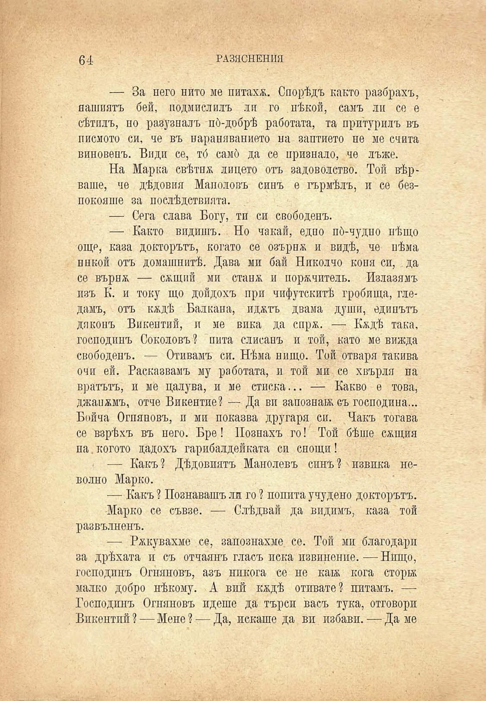

6Д	РАЗЯСНЕНИЯ

— За него нито ме питаха. Спорѣдъ както разбрахъ, нашиятъ бей, подмислилъ ли го нѣкой, самъ ли се е сѣтилъ, но разузналъ по́-добрѣ работата, та притурилъ въ писмото си, че въ нараняванието на заптието не ме счита виновенъ. Види се, тб самб да се признало, че лъже.

На Марка свѣтпж лицето отъ задоволство. Той вѣрваше, че дѣдовия Маноловъ синъ е гърмѣлъ, и се безпокояше за послѣдствията.

— Сега слава Богу, ти си свободенъ.

— Както видишъ. Но чакай, едно по́-чудно нѣщо още, каза докторътъ, когато се озърна и видѣ, че нѣма никой отъ домашнитѣ. Дава ми бай Николчо коня си, да се върнж — сжщий ми станж и порѫчитель. Излазямъ изъ К. и току що дойдохъ при чифутскитѣ гробища, гледамъ, отъ кадѣ Балкана, иджтъ двама души, едипътъ дяконъ Викентий, и ме вика да спрж. — Кждѣ така, господинъ Соколовъ ? пита слисанъ и той, като ме вижда свободенъ. — Отивамъ си. Нѣма нищо. Той отваря такива очи ей. Расказвамъ му работата, и той ми се хвърля па вратътъ, и ме цалува, и ме стиска... — Какво е това, джапамъ, отче Викентие? — Да ви запознай; съ господина... Бойча Огняновъ, и ми показва другаря си. Чакъ тогава се взрѣхъ въ него. Бре! Познахъ го! Той бѣше сжщия на. когото дадохъ гарибалдейката си снощи !

— Какъ ? Дѣдовиятъ Маноловъ синъ ? извика неволно Марко.

— Какъ ? Познавашъ ли го ? попита учудено докторътъ.

Марко се съвзе. — Слѣдвай да видимъ, каза той развълненъ.

— Рѫкувахме се, запознахме, се. Той ми благодари за дрѣхата и съ отчаянъ гласъ иска извинение.—Нищо, господинъ Огняновъ, азъ никога се не ката кога сторва малко добро нѣкому. А вий кждѣ отивате? питамъ. — Господинъ Огняновъ идеше да търси васъ тука, отговори Викентпй ? — Мене ? — Да, искаше да ви избави. — Да ме

