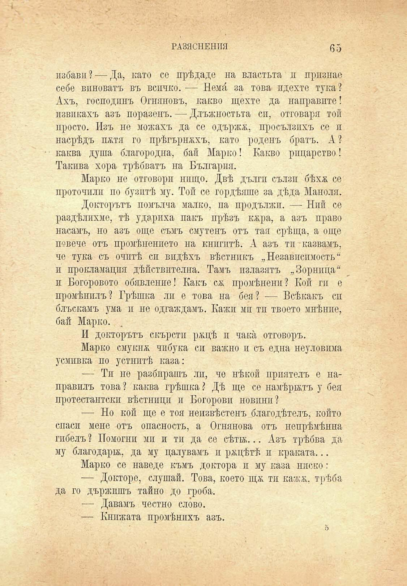

РАЗЯСНЕНИЯ	(55

избави? — Да, като се прѣдаде на властьта и признае себе виноватъ въ всичко. — Немй за това пдехте тука? Ахъ, господинъ Огняновъ, какво щехте да направите! извикахъ азъ поразенъ. — Длъжностьта сп, отговаря той просто. Изъ не можахъ да се одържж, просълзихъ се п насрѣдъ п&тя го прѣгърнахъ, като роденъ братъ. А? каква душа благородна, бай Марко! Какво рицарство! Такива хора трѣбватъ на България.

Марко не отговори нищо. Двѣ дългп сълзи бѣхѫ се проточили по бузитѣ му. Той се гордѣяше за дѣда Манола.

Докторътъ помълча малко, па продължи. — Ний се раздѣлихме, тѣ ударихѫ пакъ прѣзъ кяра, а азъ право насамъ, но азъ още съмъ смутенъ отъ тая срѣща, а още повече отъ промѣнението на книгитѣ. А азъ ти казвамъ, че тука съ очитѣ си видѣхъ вѣстникъ „Независимость“ п прокламация действителна. Тамъ пзлазятъ „Зорница“ и Богоровото обявление! Какъ сж промѣнени? Кой ги е промѣнилъ? Грѣшка ли е това на бея? — Всѣкакъ сп блъскамъ ума и не одгаждамъ. Кажи ми ти твоето мнѣнпе, бай Марко.

И докторътъ скърсти ржцѣ и чака отговоръ.

Марко смукна чибука си важно и съ една неуловима усмивка по устнитѣ каза:

— Ти не разбирашъ лп, че нѣкой приятенъ е направилъ това ? каква грѣшка ? Дѣ ще се намѣрятъ у бея протестантски вѣстници и Богорови новини?

— Но кой ще е тоя неизвѣстенъ благодѣтелъ, който спаси мене отъ опасность, а Огнянова отъ непрѣмѣнна гпбелъ ? Помогни ми и ти да се сѣти... Азъ трѣбва да му благодари, да му цалувамъ и рѫцѣтѣ и краката...

Марко се наведе къмъ доктора и му каза ниско:

— Докторе, слушай. Това, което щж. ти каж&, трѣба да го държишъ тайно до гроба.

— Давамъ честно слово.

— Книжата промѣнихъ азъ.

о

