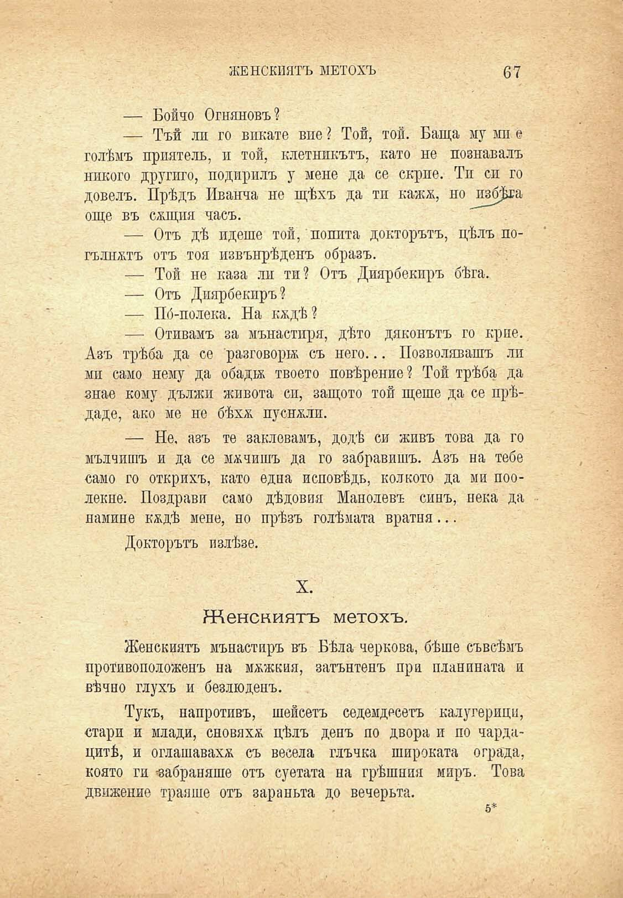

ЖЕНСКИЯТЪ МЕТОХЪ

67

— Бойчо Огняновъ?

— Тъй ли го викате впе Той, той. Баща му ми е голѣмъ приятель, и той, клетникътъ, като не познавалъ никого другиго, подирилъ у мене да се скрие. Ти си го довелъ. Прѣдъ Иванча не щѣхъ да ти кажа, но ^пзб^са още въ сжщия часъ.

— Отъ дѣ идеше той, попита докторътъ, цѣлъ погълнжтъ отъ тоя извънрѣденъ образъ.

— Той не каза ли ти? Отъ Диярбекиръ бѣга.

— Отъ Диярбекиръ?

— Пб-полека. На надѣ?

— Отивамъ за мънастиря, дѣто дяконътъ го крие. Азъ трѣба да се разговори; съ него... Позволявашъ ли ми само нему да обадтж твоето повѣрение ? Той трѣба да знае кому дължи живота си, защото той щеше да се прѣдаде, ако ме не бѣхѫ пуснжли.

— Не. азъ те заклевамъ, додѣ си живъ това да го мълчишъ и да се мучишъ да го забравишъ. Азъ на тебе само го открихъ, като една исповѣдь, колкото да ми поолекне. Поздрави само дѣдовия Манолевъ синъ, нека да намине квдѣ мене, но прѣзъ голѣмата вратня...

Докторътъ излѣзе.

X.

Женскиятъ метохъ.

Женскиятъ мънастиръ въ Бѣла чернова, бѣше съвсѣмъ противоположенъ на мѫжкия, затънтенъ при планината и вѣчно глухъ и безлюденъ.

Тукъ, напротивъ, шейсеть седемдесеть калугерици, стари и млади, сновяхж цѣлъ день по двора и по чардацитѣ, и оглашавахж съ весела глъчка широката ограда, която ги забраняше отъ суетата на грѣшния миръ. Това движение траяше отъ зараньта до вечерьта.

5*

