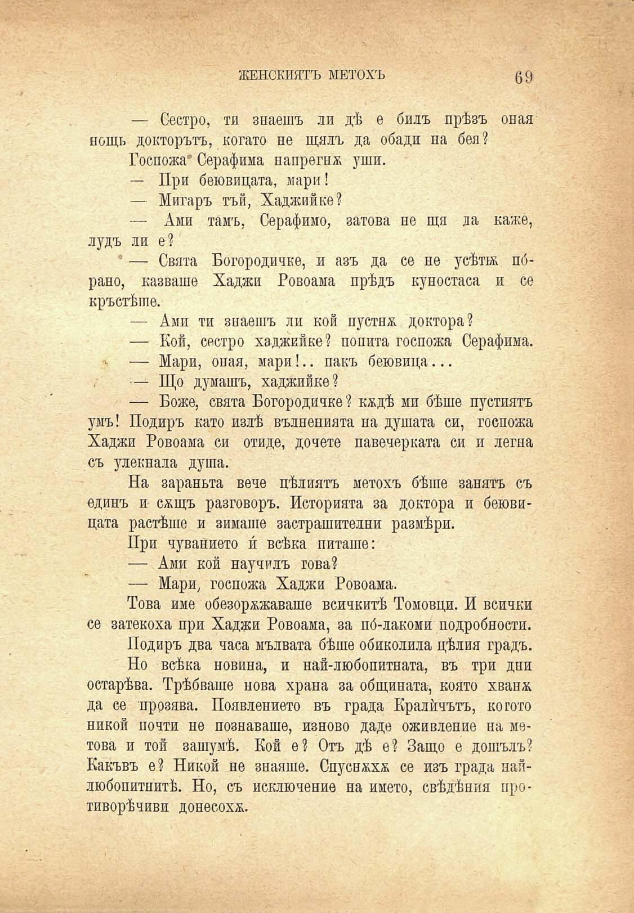

ЖЕНСКИЯТЪ МЕТОХЪ	69

— Сестро, ти знаешъ ли дѣ е билъ прѣзъ оная нощь докторътъ, когато не щялъ да обади на бея?

Госпожа’ Серафима напрегна уши.

— При беювицата, мари!

— Мигаръ тъй, Хаджийке?

— Ами тамъ, Серафимо, затова не щя да каже, лудъ ли е?

' — Свята Богородично, и азъ да се не усѣти; пбрано, казваше Хаджи Ровоама прѣдъ куностаса и се кръстѣше.

— Ами ти знаешъ ли кой пустий доктора?

— Кой, сестро хаджийке? попита госпожа Серафима.

— Мари, оная, мари!.. пакъ беювица...

— Що думашъ, хаджийке?

— Боже, свята Богородичке? кадѣ ми бѣше пустиятъ умъ! Подиръ като излѣ вълненията на душата си, госпожа Хаджи Ровоама си отиде, дочете павечерката си и легна съ улекнала душа.

На зараньта вече цѣлиятъ метохъ бѣше занятъ съ единъ и сжщъ разговоръ. Историята за доктора и беювицата растѣше и зимаше застрашителни размѣри.

При чуванието и́ всѣка питаше:

— Ами кой научилъ гова?

— Мари, госпожа Хаджи Ровоама.

Това име обезорѫжаваше всичкитѣ Томовци. И всички се затекоха при Хаджи Ровоама, за по́-лакоми подробности.

Подиръ два часа мълвата бѣше обиколила цѣлия градъ.

Но всѣка новина, и най-любопитната, въ три дни остарѣва. Трѣбваше нова храна за общината, която хванж да се прозява. Появлението въ града Кралѝчътъ, когото никой почти не познаваше, изново даде оживление на метова и той зашумѣ. Кой е? Отъ дѣ е? Защо е дошълъ? Какъвъ е? Никой не знаяше. Спусн&х;& се изъ града найлюбопитпитѣ. Но, съ исключение на името, свѣдѣния нротиворѣчиви донесоха.

