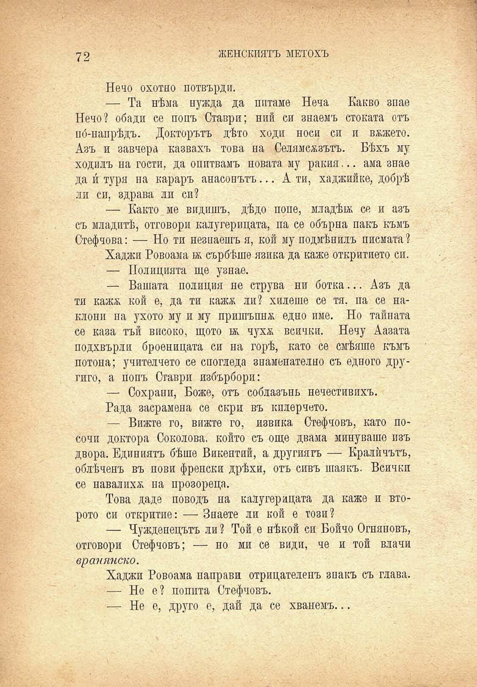

72

ЖЕНСКИЯТЪ МЕТОХЪ

Нечо охотно потвърди.

— Та нѣма нужда да питаме Неча Какво знае Нечо? обади се попъ Ставри; ний си знаемъ стоката отъ пб-папрѣдъ. Докторътъ дѣто ходи носи си и вѫжето. Азъ и завчера! казвахъ това на Селямсжзътъ. Бѣхъ му ходилъ на гости, да опитвамъ новата му ракия... ама знае да и́ туря на караръ анасонътъ... А ти, хаджийке, добрѣ ли си, здрава ли си?

— Както ме видишъ, дѣдо поне, младѣй; се и азъ съ младитѣ, отговори калугерицата, па се обърна пакъ къмъ Стефчова: — Но ти незнаешъя, кой му подмѣнилъ писмата?

Хаджи Ровоама кк. сърбѣше язика да каже откритието си.

— Полицията ще узнае.

— Вашата полиция не струва ни ботка... Азъ да ти кажж кой е, да ти кажж ли? хилеше се тя. па се наклони па ухото му и му прищъпна едно име. Но тайната се каза тъй високо, щото бь чухж всички. Нечу Аазата подхвърли броеницата си на горѣ, като се смѣяше къмъ потона; учителчето се спогледа знаменателно съ едного другиго, а попъ Ставри избърбори:

— Сохрани, Боже, отъ соблазънь нечестивихъ.

Рада засрамена се скри въ кплерчето.

— Вижте го, вижте го, извика Стефчовъ, като посочи доктора Соколова, който съ още двама минувашо пзъ двора. Единиятъ бѣше Викентий, а другиятъ — Кралѝчътъ, облѣченъ въ нови френски дрѣхи, отъ сивъ шаякъ. Всички се навалиха; на прозореца.

Това даде поводъ на калугерицата да каже и второто си откритие: — Знаете ли кой е този?

— Чужденецътъ ли ? Той е нѣкой си Бойчо Огняновъ, отговори Стефчовъ; — но ми се види, че и той влачи враиянско.

Хаджи Ровоама направи отрицателенъ знакъ съ глава.

— Не е? попита Стефчовъ.

— Не е, друго е, дай да се хванемъ...

