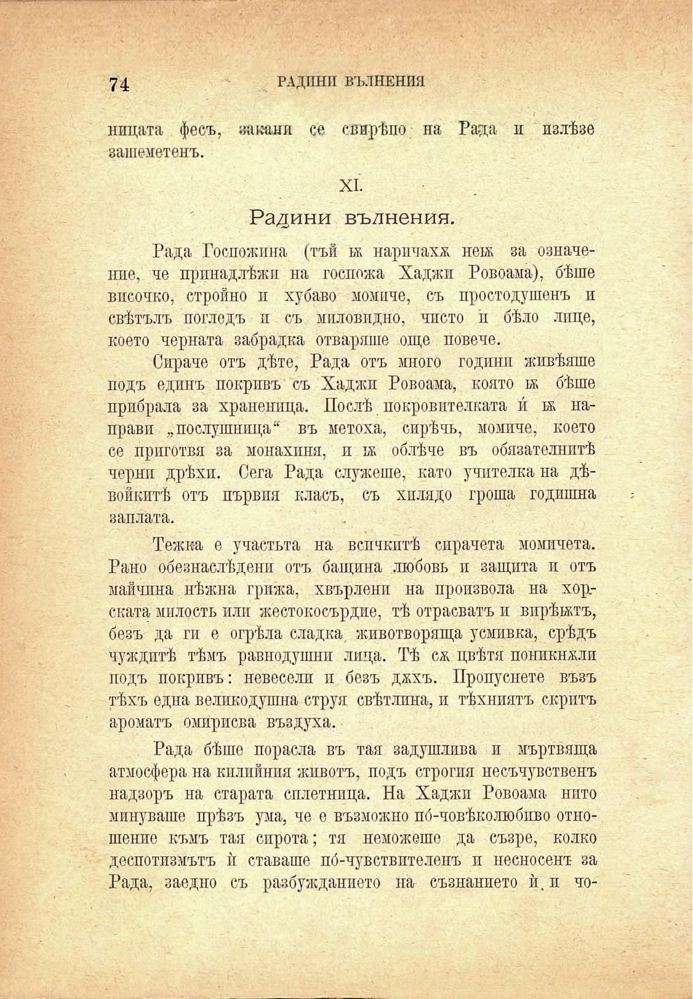

74	• ГАДИНИ ВЪЛНЕНИЯ

нпцата фесъ, закани се свирѣпо на Рада и излѣзе зашеметенъ.

XI.

Радини вълнения.

Рада Госпожица (тъй ьк наричаха неѭ за означеше, че принадлѣжп на госпожа Хаджи Ровоама), бѣше височко, стройно и хубаво момиче, съ простодушенъ и свѣтълъ погледъ и съ миловидно, чисто ѝ бѣло лице, което черната забрадка отваряше още повече.

Сираче отъ дѣте, Рада отъ много години живѣяше подъ единъ покривъ съ Хаджи Ровоама, която бѣше прибрала за храненица. Послѣ покровителката и́ ѭ направи „послушница“ въ метоха, сирѣчь, момиче, което се приготвя за монахиня, и тж облѣче въ обязателнитѣ черни дрѣхи. Сега Рада служеше, като учителка на дѣвойкитѣ отъ първпя класъ, съ хплядо гроша годишна заплата.

Тежка е участьта на всичкитѣ сирачета момичета. Рано обезнаслѣдени отъ бащина любовь и защита и отъ майчина нѣжна грижа, хвърлейи на произвола на хор.ската милость или жестокосърдие, тѣ отрасватъ и вирѣятъ, безъ да ги е огрѣла сладка, животворяща усмивка, срѣдъ чуждитѣ тѣмъ равнодушни лица. Тѣ сж цвѣтя пошкнхли подъ покривъ: невесели и безъ дххъ. Пропуснете възъ тѣхъ една великодушна струя свѣтлина, и тѣхниятъ скритъ ароматъ омирисва въздуха.

Рада бѣше порасла въ тая задушлива и мъртвяща атмосфера на килийния животъ, подъ строгия несъчувственъ надзоръ на старата сплетница. На Хаджп Ровоама нито минуваше прѣзъ ума, че е възможно по́-човѣколюбпво отношение къмъ тая сирота; тя неможешо да съзре, колко деспотизмътъ ѝ ставаше по́-чувствптеленъ и несносенъ за Рада, заедно съ разбужданпето на съзнанието ѝ. и чо-

