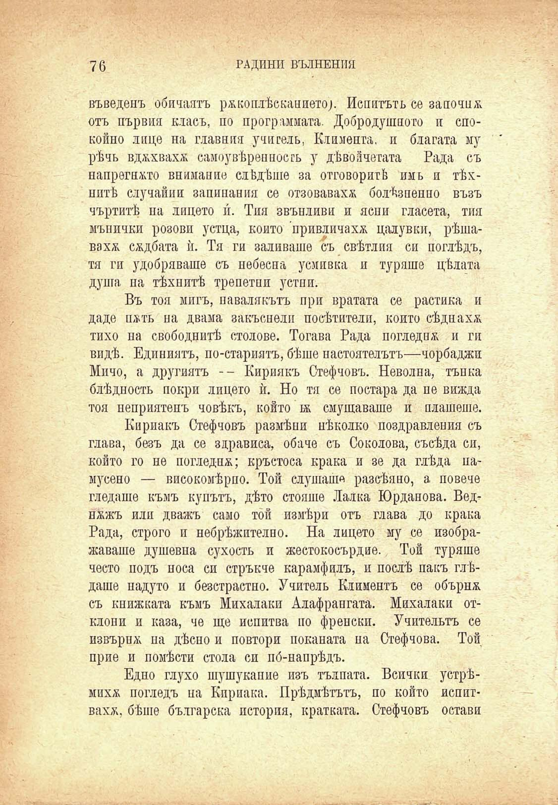

76	ГАДИНИ ВЪЛНЕНИЯ

въведенъ обичаятъ р&коплѣсканието). Пепитътъ се започна отъ първия класъ, по програмната. Добродушното и спокойпо лице на главния учитель, Климента, и благата му рѣчь вджхвахх самоувѣреппостъ у дѣвойчетата Рада съ напрегнато внимание слѣдѣше за отговоритѣ имь и тѣхнитѣ случайни запипания се отзоваваха болѣзненно възъ чъртитѣ на лицето и́. Тия звънливи и ясни гласета, тия мънички розови устца, който привличаха цалувки, рѣшавахж сѫдбата ѝ. Тя ги заливаше съ свѣтлия си поглѣдъ, тя ги удобряваше съ небесна усмивка и туряше цѣлата душа па тѣхнитѣ трепетни устни.

Въ тоя мигъ, навалякътъ при вратата се растика и даде п&ть на двама закъснели посѣгатели, който сѣднаха тихо на свободнитѣ столове. Тогава Рада погледна и ги видѣ. Единиятъ, по-стариятъ, бѣше настоятелътъ—чорбаджи Мичо, а другиятъ -- Кириякъ Стефчовъ. Неволна, тънка блѣдность покри лицето ѝ. Но тя се постара да пе вижда тоя неприятенъ човѣкъ, който и́ж смущаваше и плашеше.

Кириакъ Стефчовъ размѣни нѣколко поздравления съ глава, безъ да се здрависа, обаче съ Соколова, съсѣда си, който го не погледна; кръстоса крака и зе да глѣда памусено — високомѣрно. Той слушаше разсѣяно, а повече гледаше къмъ купътъ, дѣто стояше Лалка Юрданова. Веднажъ или дважъ само той измѣри отъ глава до крака Рада, строго и небрѣжително. На лицето му се изображаваше душевна сухость и жестокосърдие. Той туряше често подъ носа си стръкче карамфилъ, и послѣ пакъ глѣдаше надуто и безстрастно. Учитель Климентъ се обърна съ книжната къмъ Михалаки Алафрангата. Михалаки отклони и каза, че ще испитва по френски. Учительтъ се извърна па дѣсно и повтори поканата на Стефчова. Той прие и помѣсти стола си по́-напрѣдъ.

Едно глухо шушукапие изъ тълпата. Всички устрѣмихж погледъ па Кприака. Прѣдмѣтътъ, по който допитваха, бѣше българска история, кратката. Стефчовъ остави

