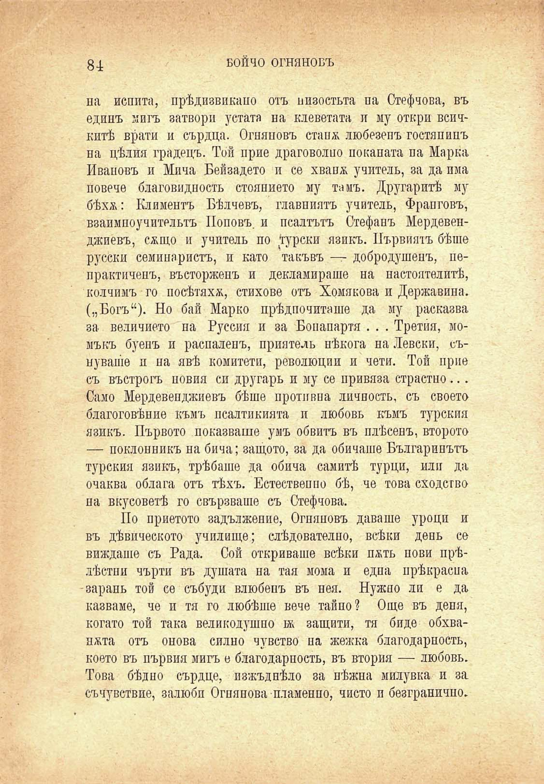

84	БОЙЧО ОГНЯНОВЪ

на пепита, прѣдизвикано отъ низостьта па Стефчова, въ единъ мигъ затвори устата на клеветата и му откри всичкитѣ врати и еърдца. Огняновъ стапя любезенъ гостянипъ на цѣлия градецъ. Той прие драговолно поканата па Марка Ивановъ и Мича Бейзадето и се хвапя учитель, за да има повече благовидность стоянието му тамъ. Другаритѣ му бѣхя: Климентъ Бѣлчевъ, главниятъ учитель, Франговъ, взаимпоучительтъ Поповъ, и псалтътъ Стефанъ Мердевенджиевъ, сящо и учитель по турски язикъ. Първиятъ бѣше русски семинаристъ, и като такъвъ — добродушенъ, непрактиченъ, въсторженъ и декламираше на настоятелитѣ, колчемъ го поеѣтяхя, стихове отъ Хомякова и Державина. („Богъ“)- Но бай Марко прѣдпочиташе да му расказва за величието на Руссия и за Бонапарта . . . Третия, момъкъ буенъ и распаленъ, приятель нѣкога на Левски, сънуваше и на явѣ комитети, революции и чети. Той прие съ въстрогъ повия си другарь и му се привяза страстно... Само Мердевепджиевъ бѣше противна личность, съ своето благоговѣние къмъ псалтикията и любовь къмъ турския язикъ. Първото показваше умъ обвитъ въ плѣсенъ, второто — поклонникъ на бича; защото, за да обичаше Българинътъ турския язикъ, трѣбаше да обича самитѣ турци, или да очаква облага отъ тѣхъ. Естествеппо бѣ, че това сходство на вкусоветѣ го свързваше съ Стефчова.

По приетото задължение, Огняновъ даваше уроци и въ дѣвическото училище; слѣдователно, всѣки день се виждаше съ Рада. Сой откриваше всѣки пжть пови прѣлѣстни чърти въ душата на тая мома и една прѣкрасна зарань той се събуди влюбенъ въ нея. Нужно ли е да казваме, че и тя го любѣше вече тайно? Още въ деня, когато той така великодушно въ защити, тя биде обхванята отъ онова силно чувство на жежка благодарность, което въ първия мигъ е благодарность, въ втория — любовь. Това бѣдно сърдце, изжъднѣло за нѣжна милувка и за съчувствие, залюби Огнянова пламенно, чисто и безгранично.

