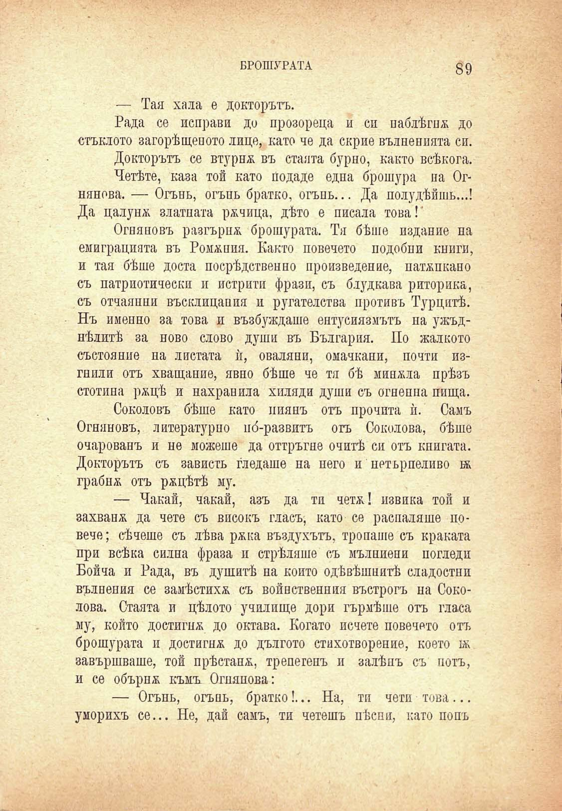

БРОШУРАТА	39

— Тая хала е докторътъ.

Рада се неправи до прозореца и си наблѣгнж до стъклото загорѣщепото лице, като че да скрие вълненията си.

Докторътъ се втурна въ стаята бурно, както всѣкога.

Четѣте, каза той като Подаде една брошура па Огнянова. — Огънь, огънь братко, огънь... Да полудѣйшь...! Да цалуна златната раница, дѣто е писала това!’

Огняновъ разгърна брошурата. Тя бѣше издание на емиграцията въ Ромапия. Както повечето подобни книги, и тая бѣше доста посрѣдственно произведение, натѫпкано съ патриотически и истрити фрази, съ блудкава риторика, съ отчаяний въсклицания и ругателства противъ Турцитѣ. Нъ именно за това. и възбуждаше ентусиазмътъ па ужъднѣлитѣ за ново слово души въ България. По жалкото състояние на листата ѝ, оваляни, омачкани, почти пзгнили отъ хващание, явно бѣше че тя бѣ минала прѣзъ стотина рацѣ и нахранила хиляди души съ огнеппа пища.

Соколовъ бѣше като пиянъ отъ прочита ѝ. Самъ Огняновъ, литературно по́-развитъ отъ Соколова, бѣше очарованъ и не можеше да оттръгне очитѣ си отъ книгата. Докторътъ съ зависть гледаше на него и нетърпеливо ж грабна отъ рацѣтѣ му.

— Чакай, чакай, азъ да ти чета! извика той и захвана да чете съ високъ гласъ, като се распаляше повече; сѣчеше съ лѣва рака въздухътъ, тропаше съ краката при всѣка силна фраза и стрѣляше съ мълниени погледи Бойча и Рада, въ душитѣ на който одѣвѣшнитѣ сладостни вълнения се замѣстихѫ съ вопнственния въстрогъ на Соколова. Стаята и цѣлото училище дори гърмѣше отъ гласа му, който достигна до октава. Когато печете повечето отъ брошурата и достигна до дългото стихотворение, което 1ж завършваше, той прѣстана, трепетенъ и залѣнъ съ потъ, и се обърна къмъ Огнянова:

— Огънь, огънь, братко!... На, тп чети това... уморихъ се... Не, дай самъ, ти четешъ пѣсни, като попъ

