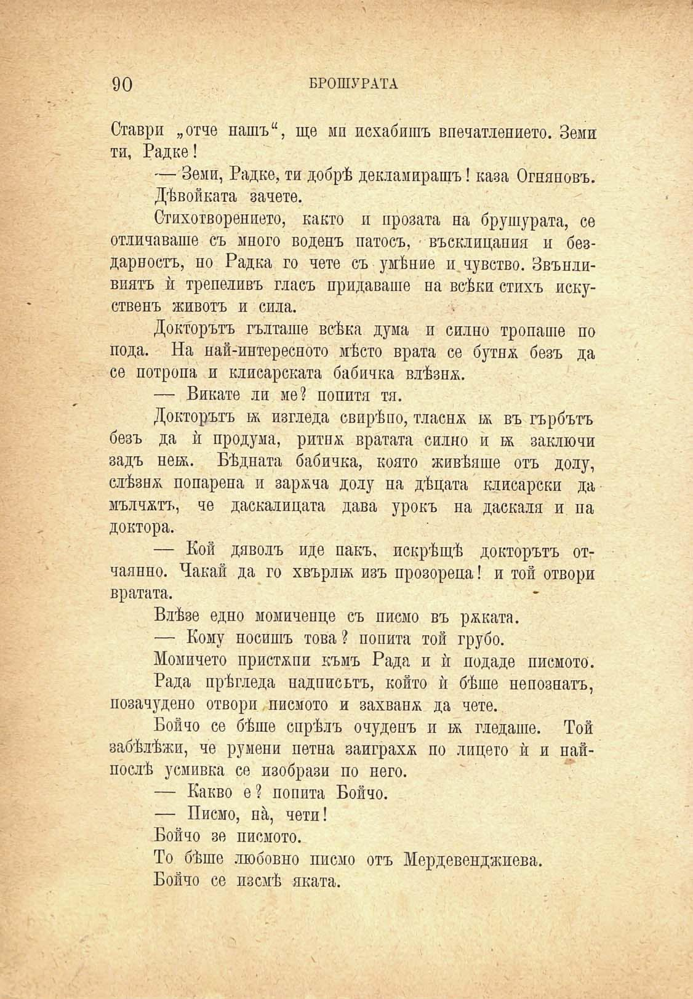

90

БРОШУРАТА

Ставри „отче нашъ“, ще ми похабишъ впечатлението. Земи ти, Радке!

— Земи, Радке, ти добрѣ декламиращъ! каза Огняновъ.

Дѣвойката зачете.

Стихотворенпето, както и прозата на брушурата, се отличаваше съ много воденъ патосъ, въсклицания и бездарностъ, но Радка го чете съ умѣние и. чувство. Звънливиятъ ѝ трепеливъ гласъ придаваше на всѣки стихъ искуственъ животъ и сила.

Докторътъ гълташе всѣка дума и силно тропаше по пода. На най-интересното мѣсто врата се бутнж безъ да се потропа и клисарската бабичка влѣзнж.

— Викате ли ме? попитя тя.

Докторътъ вк изгледа свирѣпо, тласна кк въ гърбътъ безъ да ѝ продума, ритнж вратата силно и бк заключи задъ неж. Бѣдната бабичка, която живѣяше отъ долу, слѣзня попарена и зареча долу на дѣцата клисарски да мълчатъ, че даскалицата дава урокъ на даскала и па доктора.

— Кой дяволъ иде пакъ, искрѣщѣ докторътъ отчаянно. Чакай да го хвърли изъ прозореца! и той отвори вратата.

Влѣзе едно момиченце съ писмо въ рѣката.

— Кому носишъ това? попита той грубо.

Момичето пристѫпи къмъ Рада и ѝ подаде писмото.

Рада прѣгледа надписътъ, който ѝ бѣше непознатъ, позачудено отвори писмото и захвана да чете.

Бойчо се бѣше спрѣлъ очудепъ и н; гледаше. Той забѣлѣжи, че румени петна заиграха по лицето ѝ и найпослѣ усмивка се изобрази по него.

— Какво е? попита Бойчо.

— Писмо, на, чети!

Бойчо зе писмото.

То бѣше любовно писмо отъ Мердевенджиева.

Бойчо се изсмѣ яката.

