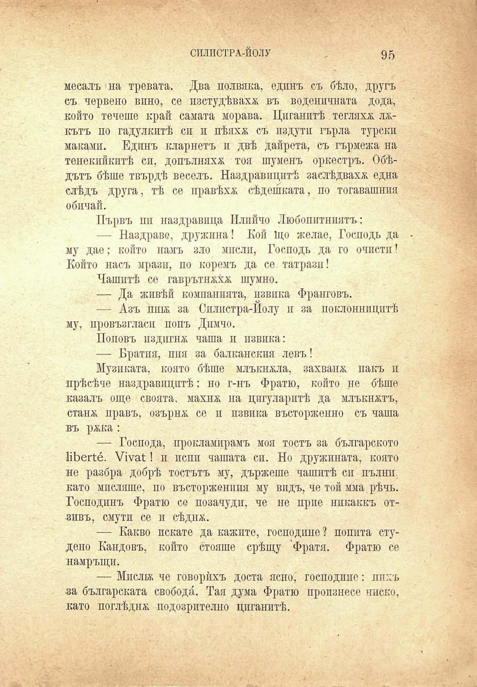

СИЛИСТРА-ЙОЛУ	,	95

месалъ на тревата. Два полвяка, единъ съ бѣло, другъ съ червено вино, се изстудѣвахж въ воденичната до да, който течеше край самата морава. Циганитѣ теглихѫ л^кътъ по гадулкитѣ си и пѣяхж съ издути гърла турски маками. Единъ кларнетъ и двѣ дайрета, съ гърмежа на тенекпйкптѣ сп, допълняха тоя шуменъ оркестръ. Обѣдътъ бѣше твърдѣ веселъ. Наздравицитѣ заслѣдвахж. една слѣдъ друга, тѣ се правѣха сѣдешката, по тогавашния обичай.

Първъ пи наздравица Плийчо Любопитниятъ:

— Наздраве, дружина! Кой Що желае, Господъ да му дае; който намъ зло мисли, Господъ да го очисти' Който пасъ мрази, по коремъ да се татрази!

Чашитѣ се гаврътнаха; шумно.

— Да живѣй компанията, извика Франговъ.

— Азъ пш за Силистра-Йолу и за поклонницитѣ му, провъзгласи попъ Димчо.

Поповъ издигна чаша и извика:

— Вратня, пия за балканския левъ!

Музиката, която бѣше млъкнаха, захвана; пакъ и прѣсѣче наздравицитѣ: но г-нъ Фратю, който не бѣше казалъ още своята, махна; на цигуларитѣ да млъкнатъ, стана; правъ, озърна; се и извика въсторженно съ чаша въ ржка:

— Господа, прокламирамъ моя тостъ за българското НЬегѣе́. У1ма1:1 и пени чашата си. Но дружината, която не разбра добрѣ тостътъ му, държеше чашитѣ си пълни, като мисляше, по въсторженппя му видъ, че той мма рѣчъ. Господинъ Фратю се позачуди, че не прие никаккъ от•зивъ, смути се и сѣдна;.

— Какво искате да важите, господине? попита студено Пандовъ, който стояше срѣщу Фратя. Фратю се намръщи.

— Мисли; че говорѣхъ доста ясно, господине: пихъ ■за българската свобода. Тая дума Фратю произнесе ниско, като послѣдна подозрително циганитѣ.

