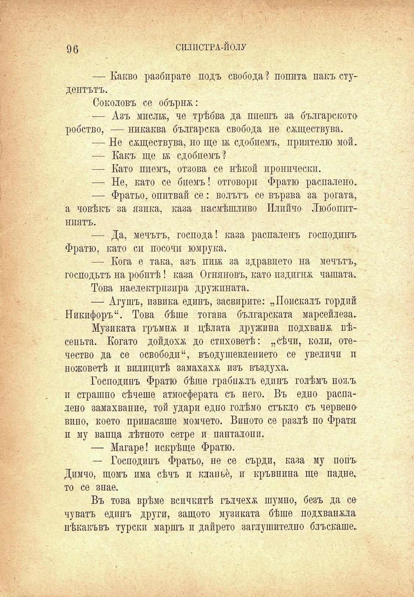

96	СИЛИСТРА-ЙОЛУ

— Какво разбирате подъ свобода ? попита пакъ студентътъ.

Соколовъ се обърнж:

— Азъ мисли, че трѣбва да пиешъ за българското робство, — никаква българска свобода не смцествува.

— Не сѫществува, но ще и сдобиемъ, приятелю мой.

— Какъ ще и сдобиемъ?

— Като пиемъ, отзова се нѣкой иронически.

— Не, като се биемъ! отговори Фратю распалено.

— Фратьо, опитвай се: волътъ се вързва за рогата, а човѣкъ за язика, каза насмѣшливо Илийчо Любопитниятъ.

— Да, мечътъ, господа! каза распаленъ господинъ Фратю, като си посочи юмрука.

— Кога е така, азъ пшж за здравието на мечътъ,, господътъ на робитѣ! каза Огняновъ, като издпгнж. чашата.

Това наелектризира дружината.

— Агушъ, извика единъ, засвирите: „Поискалъ гордий Никифоръ“. Това бѣше тогава българската марсейлеза.

Музиката гръмна и цѣлата дружина подхвана пѣсеньта. Когато дойдохѫ до стиховетѣ: „сѣчи, коли, отечество да се освободи“, въодушевлението се увеличи п ножоветѣ и вилицитѣ замахаха изъ въздуха.

Господинъ Фратю бѣше грабналъ единъ голѣмъ ножъ, и страшно сѣчеше атмосферата съ него. Въ едно распалено замахвапие, той удари едно голѣмо стъкло съ червеновино, което принасяше момчето. Виното се разлѣ по Фратя и му вапца лѣтното сетре и панталони.

— Магаре! искрѣщо Фратю.

— Господинъ Фратьо, не се сърди, каза му попъ Димчо, щомъ има сѣчъ и клапье, и кръвнина ще падне, то се знае.

Въ това врѣме всичкитѣ гълчеха шумно, безъ да се чуватъ единъ други, защото музиката бѣше подхваната нѣкакъвъ турски маршъ и дайрето заглушително блъскаше.

