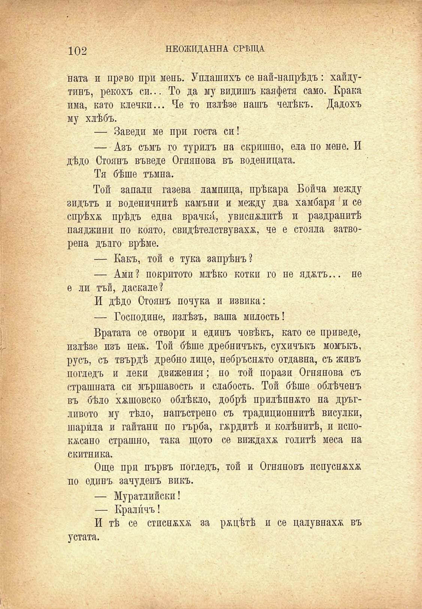

* V ??•■	-'; ~ ' - ' V ^.■' ?* -^'1	? .' ?.	' ■ ■

102

НЕОЖИДАННА СРѢЩА

вата и право при мень. Уплашихъ се най-напрѣдъ: хайдутинъ, рекохъ си... То да му видишъ каяфети само. Крака има, като клечки... Че то излѣзе нашъ челѣкъ. Дадохъ му хлѣбъ.

— Заведи ме при госта си!

— Азъ съмъ го турилъ на скришно, ела по мене. И дѣдо Стоянъ въведе Огнянова въ воденицата.

Тя бѣше тъмна.

Той запали газева лампица, прѣкара Бойча между зидътъ и воденичнитѣ камъни и между два хамбаря и се спрѣха прѣдъ една врачка, увисвалитѣ и раздранитѣ паяджини по която. свидѣтелствувах&, че е стояла затворена дълго врѣме.

— Какъ, той е тука запрѣнъ?

— Ами? покритото млѣко котки го не яджтъ... не е ли тъй, даскале?

И дѣдо Стоянъ почука и извика:

— Господине, излѣзъ, ваша милость!

Вратата се отвори и единъ човѣкъ, като се приведе, излѣзе изъ неж. Той бѣше дребничъкъ, сухичъкъ момъкъ, русъ, съ твърдѣ дребно лице, небръснато отдавна, съ живъ погледъ и леки движения; но той порази Огнянова съ страшната си мършавость и слабость. Той бѣше облѣченъ въ бѣло хжшовско облѣкло, добрѣ прилѣпнжто на дръгливото му тѣло, напъстрено съ традиционнитѣ висулки, шарила и гайтани по гърба, гордитѣ и колѣнитѣ, и испокжсано страшно, така щото се виждаха голитѣ меса на скитника.

Още при първъ погледъ, той и Огняновъ испуснжхж по единъ зачуденъ викъ.

— Муратлийски!

— Кралпчъ!

И тѣ се стиснжхж за рѫцѣтѣ и се цалувнахк въ устата.

