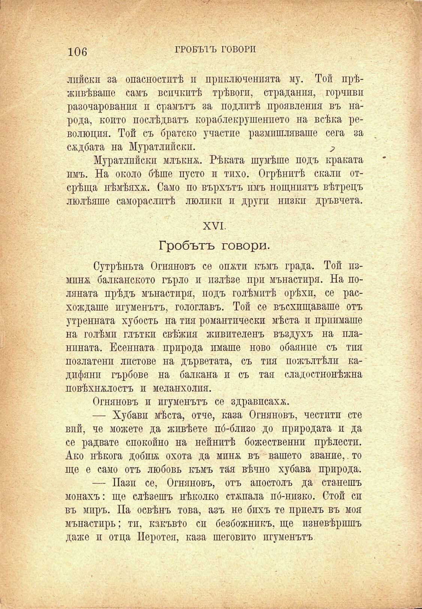

106	ГРОБЪТЪ ГОВОРИ

лийски за опасноститѣ и приключенията му. Той прѣживѣваше самъ всичкитѣ трѣвоги, страдания, горчиви разочарования и срамътъ за подлитѣ проявления въ народа, който послѣдватъ кораблекрушението на всѣка революция. Той съ братско участие размишляваше сега за сѫдбата на Муратлийски.	2

Муратлийски млъкна. Рѣката шумѣше подъ краката имъ. На около бѣше пусто и тихо. Огрѣнитѣ скали отсрѣща нѣмѣяхх,. Само по върхътъ имъ нощниятъ вѣтрецъ люлѣяше самораслитѣ люлики и други низки дръвчета.

XVI.

Гробътъ говори.

Сутрѣньта Огняновъ се опжти къмъ града. Той пзминж балканското гърло и излѣзе при мънастиря. На поляната прѣдъ мънастиря, подъ голѣмитѣ орѣхи, се расхождаше игуменътъ, гологлавъ. Той се въсхлщаваше отъ утренната хубость на тия романтически мѣста и приимаше на голѣми глътки свѣжия живителенъ въздухъ на планпната. Есенната природа имаше ново обаяние съ тия позлатенп листове на дърветата, съ тия пожълтѣли кадифяни гърбове на балкана и съ тая сладостнонѣжна повѣхналость и меланхолия.

Огняновъ и игуменътъ се здрависаха.

— Хубави мѣста, отче, каза Огняновъ, честити сте вий, че можете да живѣете по́-близо до природата и да се радвате спокойно на нейнитѣ божествений прѣлести. Ако нѣкога добивъ охота да минж въ вашето звание,. то ще е само отъ любовь къмъ тая вѣчно хубава природа.

— Пази се, Огняновъ, отъ апостолъ да станешъ монахъ: ще слѣзешъ нѣколко стжпала по́-низко. Стой сп въ миръ. Па освѣнъ това, азъ не бихъ те приелъ въ моя мънастирь; тп, какъвто си безбожникъ, ще изневѣришъ даже и отца Иеротея, каза шеговито игуменътъ

