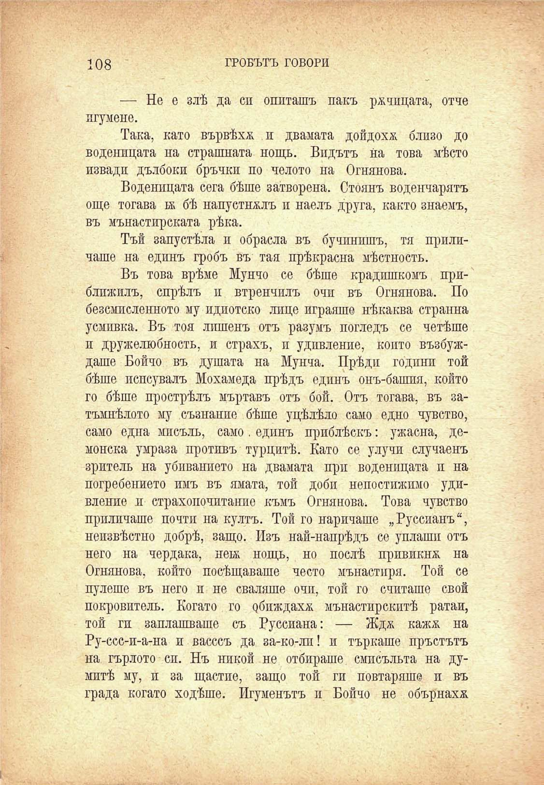

108	ГРОБЪТЪ ГОВОРИ

— Не е злѣ да си опиташъ пакъ рапицата, отче игумене.

Така, като вървѣха и двамата дойдохѫ близо до воденицата на страшната нощь. Видътъ на това мѣсто извади дълбоки бръчки по челото на Огнянова.

Воденицата сега бѣше затворена. Стоянъ воденчарятъ още тогава к бѣ напустнмлъ и наелъ друга, както знаемъ, въ мънастирската рѣка.

Тъй запустѣла и обрасла въ бучпнишъ, тя приличаше на единъ гробъ въ тая прѣкрасна мѣстность.

Въ това врѣме Мунчо се бѣше крадишкомъ приближилъ, спрѣлъ и втренчилъ очи въ Огнянова. По безсмисленото му идиотско лице играяше нѣкаква странна усмивка. Въ тоя лишенъ отъ разумъ погледъ се четѣше и дружелюбность, и страхъ, и удивление, който възбуждаше Бойчо въ душата на Мунча. Прѣди години той бѣше испсувалъ Мохамеда прѣдъ единъ онъ-башия, който го бѣше прострѣлъ мъртавъ отъ бой. Отъ тогава, въ затъмнѣлото му съзнание бѣше уцѣлѣло само едно чувство, само една мисъль, само. единъ приблѣскъ: ужасна, демонска умраза противъ турцитѣ. Като се улучи случаенъ зритель на убиванието на двамата при воденицата и на погребението имъ въ ямата, той доби непостижимо удивление и страхопочитание къмъ Огнянова. Това чувство приличаше почти на култъ. Той го наричаше „Руссианъ“, неизвѣстно добрѣ, защо. Изъ най-напрѣдъ се уплаши отъ него на чердака, неьк нощь, но послѣ привикна на Огнянова, който посѣщаваше често мънастиря. Той се пулете въ него и не сваляше очи, той го считаше свой покровитель. Когато го обиждаха мънастирскптѣ ратаи, той гп заплашваше съ Руссиана: — Ждж кажж на Ру-ссс-и-а-на и васссъ да за-ко-ли! и търкаше пръстътъ на гърлото си. Нъ никой не отбираше смпсъльта на думитѣ му, и за щастие, защо той ги повтаряше и въ града когато ходѣше. Игуменътъ и Бойчо не обърнаха

