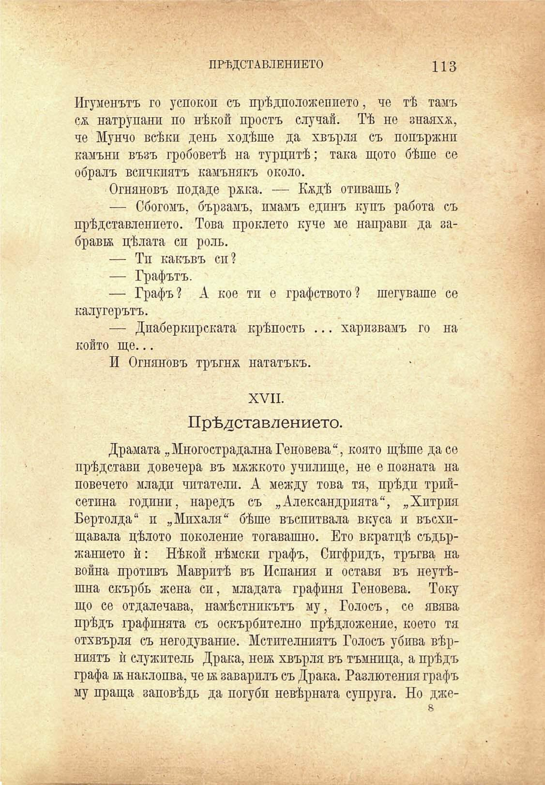

ПРѢДСТАВЛЕНИЕТО	113

Игуменътъ го успокои съ прѣдположението, че тѣ тамъ сж натрупани по нѣкой простъ случай. Тѣ не знаяхж, че Мунчо всѣки день ходѣше да хвърля съ попържнп камъни възъ гробоветѣ на турцитѣ; така щото бѣше се обралъ всичкиятъ камънякъ около.

Огняновъ подаде ржка. — Надѣ отивашъ?

— Сбогомъ, бързамъ, имамъ единъ купъ работа съ прѣдставлението. Това проклето куче ме направи да забрави; цѣлата си роль.

— Ти какъвъ сп?

— Графътъ.

— Графъ? А кое ти е графството? шегуваше се калугерътъ.

— Диаберкирската крѣпость ... харизвамъ го на който ще...

И Огняновъ тръгнж нататъкъ.

XVII.

Прѣдставлението.

Драмата „Многострадална Геновева“, която щѣше да се прѣдстави довечера въ мѫжкото училище, не е позната на повечето млади читатели. А между това тя, прѣди трийсетина години, наредъ съ „Александрията“, „Хитрия Бертолда“ и „Михаля“ бѣше въспитвала вкуса и въсхищавала цѣлото поколение тогавашно. Ето вкратцѣ съдържанието ѝ: Нѣкой нѣмски графъ, Сигфридъ, тръгва, на война противъ Мавритѣ въ Испания и оставя въ неутѣшна скърбь жена си, младата графиня Геновева. Току що се отдалечава, намѣстникътъ му, Голосъ, се явява прѣдъ графинята съ оскърбително прѣдложение, което тя отхвърля съ негодувание. Мстителниятъ Голосъ убива вѣрниятъ ѝ служитель Драка, неѭ хвърля въ тъмница, а прѣдъ графа ѭ наклопва, че и заварилъ съ Драка. Разлютенпя графъ му праща заповѣдь да погуби невѣрната супруга. Но дже8

