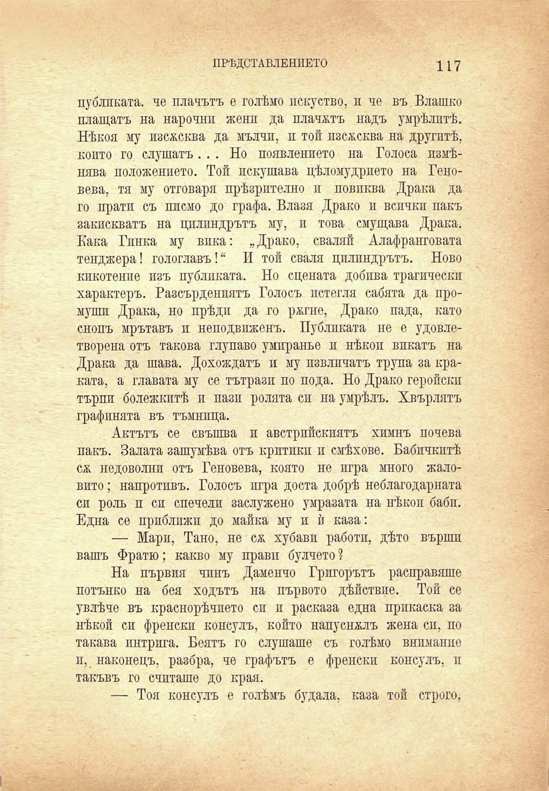

ПРѢДСТАВЛЕНИЕТО	Ц7

публиката, че плачътъ е голѣмо пскуство, и че въ Влашко плащатъ на нарочнп женп да плачатъ надъ умрѣлптѣ. Нѣкоя му изсъсква да мълчи, и той изсъсква на другитѣ, който го слушатъ... Но появлението на Голоса пзмѣнява положението. Той искушава цѣломудрието на Геновева, тя му отговаря прѣзрително и повиква Драка да го прати съ писмо до графа. Влазя Драко и всички пакъ закискватъ на цплиндрътъ му, и това смущава Драка. Кака Гинка му вика: „Драко, сваляй Алафранговата тенджера! гологлавъ!“ И той сваля цплиндрътъ. Ново кикотение изъ публиката. Но сцената добива трагически характеръ. Разсърденпятъ Голосъ истегля сабята да промуши Драка, но прѣди да го ржгне, Драко пада, като снопъ мрътавъ и неподвиженъ. Публиката не е удовлетворена отъ такова глупаво умпранье и нѣкои викатъ на Драка да шава. Дохождатъ и му извличатъ трупа за краката, а главата му се тътрази по пода. Но Драко геройски търпи болежкитѣ п пази ролята си на умрѣлъ. Хвърлятъ графинята въ тъмница.

Актътъ се свъшва и австрийскиятъ химнъ почева пакъ. Залата зашумѣва отъ критики и смѣхове. Бабпчкптѣ сж недоволни отъ Геновева, която не игра много жаловпто; напротивъ. Голосъ игра доста добрѣ неблагодарната си роль и си спечели заслужено умразата на нѣкои баби. Една се приближи до майка му и ѝ каза:

— Мари, Тано, не сѫ хубави работи, дѣто върши вашъ Фратю; какво му прави булчето ?

На първия чинъ Даменчо Григорътъ расправяше потънко на бея ходътъ на първото дѣйствпе. Той се увлѣче въ краснорѣчпето си и расказа една прикаска за нѣкой си френски консулъ, който напусналъ жена сп, по такава интрига. Беятъ го слушаше съ голѣмо внимание и, наконецъ, разбра, че графътъ е френски консулъ, и такъвъ го считаше до края.

— Тоя консулъ е голѣмъ будала, каза той строго,

