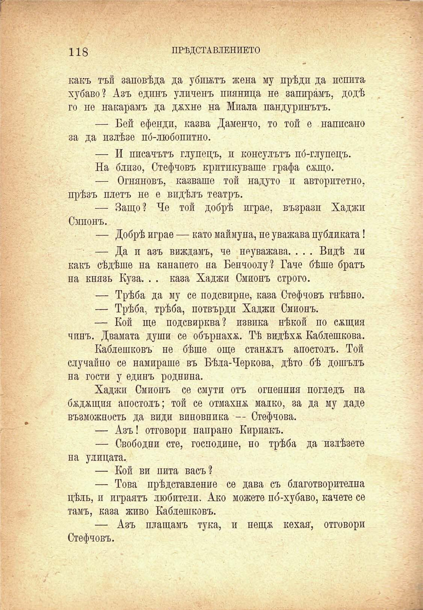

118

ПРѢДСТАВЛЕНИЕТО

какъ тъй заповѣда да убиятъ жена му прѣди да пепита хубаво? Азъ единъ уличенъ пияница не запирамъ, додѣ го не накарамъ да дххне на Миала пандуринътъ.

— Бей ефенди, казва Даменчо, то той е напивано за да излѣзе по́-любопитно.

— И писачътъ глупецъ, и консулътъ по́-глупецъ.

На близо, Стефчовъ критикуваше графа салцо.

— Огняновъ, казваше той надуто и авторитетно, прѣзъ плетъ не е видѣлъ театръ.

— Защо? Че той добрѣ играе, възрази Хаджи Смионъ.

— Добрѣ играе — като маймуна, ие уважава публиката!

— Да и азъ виждамъ, че неуважава. . . . Видѣ ли какъ сѣдѣше на канапето на Бенчоолу? Гаче бѣше братъ на князе Куза. . . каза Хаджи Смионъ строго.

— Трѣба да му се подсвирне, каза Стефчовъ гнѣвно.

— Трѣбя, трѣба, потвърди Хаджи Смионъ.

— Кой ще подсвирква? извика нѣкой по сжщия чинъ. Двамата души се обърнаха. Тѣ видѣха Каблешкова.

Каблешковъ не бѣше още станалъ апостолъ. Той случайно се намираше въ Бѣла-Черкова, дѣто бѣ дошълъ на гости у единъ роднина.

Хаджи Смионъ се смути отъ огпенния погледъ на бадащия апостолъ; той се отмахна малко, за да му даде възможность да види виновника — Стефчова.

— Азъ! отговори направо Кириакъ.

— Свободни сте, господине, но трѣба да излѣзете на улицата.

— Кой ви пита васъ?

— Това прѣдставление се дава съ благотворителна цѣлъ, и играятъ любители. Ако можете по́-хубаво, качете се тамъ, каза живо Каблешковъ.

— Азъ плащамъ тука, и нещж кехая', отговори

Стефчовъ.

