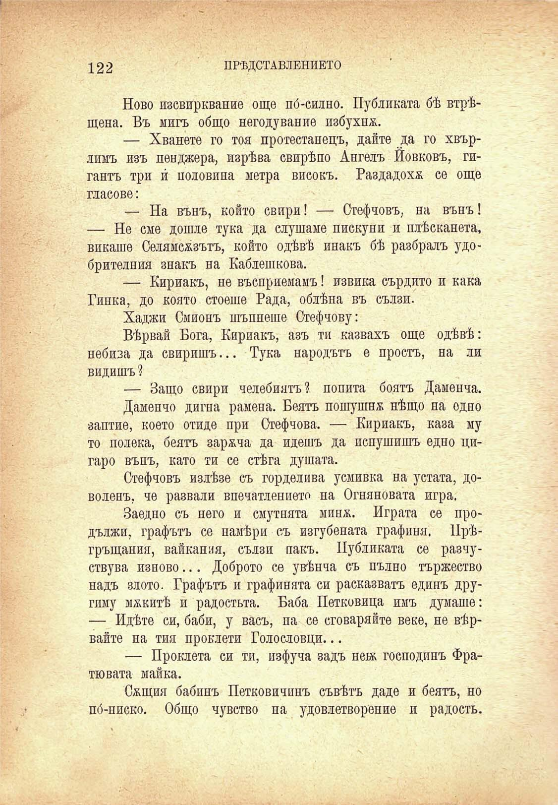

122	ПРѢДСТАВЛЕНИЕТО

Ново изсвиркваме още по́-силно. Публиката бѣ втрѣщена. Въ мигъ общо негодувание избухна.

— Хванете го тоя протестанецъ, дайте да го хвърлимъ изъ пенджера, изрѣва свирѣпо Ангелъ Йовковъ, гигантъ три и́ половина метра високъ. Раздадохѫ се още гласове:

— На вънъ, който свири! — Стефчовъ, на вънъ! — Не сме дошле тука да слушаме пискуни и плѣсканета, викаше Селямсжзътъ, който одѣвѣ инакъ бѣ разбралъ удобрителния знакъ на Каблешкова.

— Кириакъ, не въсприемамъ! извика сърдито и кака Гинка, до която стоеше Рада, облѣна въ сълзи.

Хаджи Смионъ шъпнеше Стефчову:

Вѣрвай Бога, Кириакъ, азъ ти казвахъ още одѣвѣ: небиза да свиришъ... Тука народътъ е простъ, на ли видишъ ?

— Защо свири челебиятъ? попита боятъ Даменча.

Дамепчо дигна рамена. Беятъ пошушна нѣщо на едно заптие, което отиде при Стефчова. — Кириакъ, каза му то полека, беятъ зареча да идешъ да испушишъ едно цигаро вънъ, като ти се стѣга душата.

Стефчовъ излѣзе съ горделива усмивка на устата, доволенъ, че развали впечатлението на Огняновата игра.

Заедно съ него и смутнята минж. Играта се продължи, графътъ се намѣри съ изгубената графиня. Прѣгръщания, вайкания, сълзи пакъ. Публиката се разчуствува изново... Доброто се увѣнча съ пълно тържество надъ злото. Графътъ и графинята си расказватъ единъ другиму мекитѣ и радостьта. Баба Петковица имъ думаше: — Идѣте си, баби, у васъ, па се сговаряйте веке, не вѣрвайте на тия проклети Голословни...

— Проклета си ти, изфуча задъ неѭ господинъ Фратювата майка.

Сжщия бабинъ Петковичпнъ съвѣтъ даде и беятъ, но пб-ниско. Общо чувство на удовлетворение и радость.

