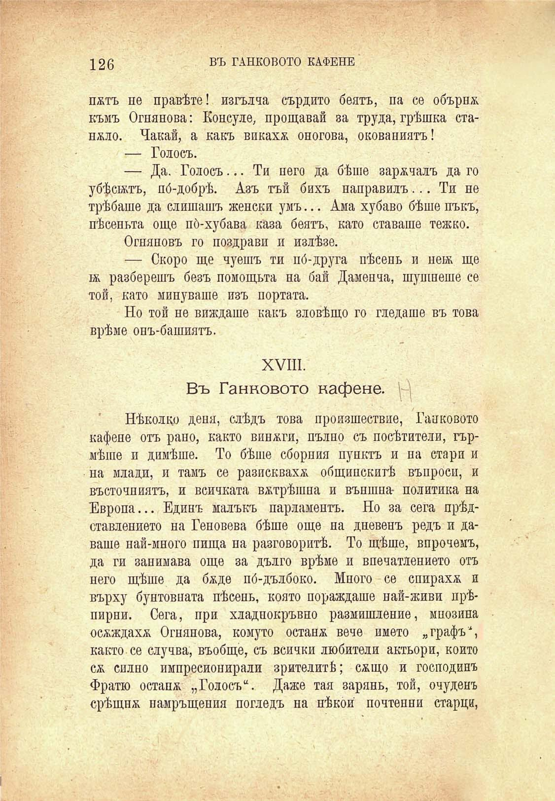

126

ВЪ ТАНКОВОТО КАФЕНЕ

пмтъ не правѣте! изгълта сърдито беятъ, па се обърна къмъ Огнянова: Консуле, прощавай за труда, грѣшка станжло. Чакай, а какъ викаха оногова, окованиятъ!

— Голосъ.

— Да. Голосъ... Ти него да бѣше зариталъ да го убфсжгъ, по́-добрѣ. Азъ тъй бихъ направилъ... Ти не трѣбаше да слишашъ женски умъ... Ама хубаво бѣше пъкъ, пѣсеньта още по́-хубава каза беятъ, като ставаше тежко.

Огняновъ го поздрави и излѣзе.

— Скоро ще чуешъ ти по́-друга пѣсень и цевь ще н; разберешъ безъ помощьта на бай Даменча, шушнеше се той, като минуваше изъ портата.

Но той не виждаше какъ зловѣщо го гледаше въ това врѣме онъ-башиятъ.

XVIII.

Въ Танковото кафене. Н

Нѣколко деня, слѣдъ това произшествие, Танковото кафене отъ рано, както винаги, пълно съ посѣтители, гърмѣше и димѣше. То бѣше сборния пунктъ и па стари и на млади, и тамъ се разискваха общинскитѣ въпроси, и въсточпиятъ, и всичката вѫтрѣшна и външна: политика на Европа... Единъ малъкъ парламентъ. Но за сега нрѣдставлението на Геновева бѣше още на дневенъ редъ и даваше най-много пища на разговоритѣ. То щѣше, впрочемъ, да ги занимава още за дълго врѣме и впечатлението отъ него щѣше да бѫде по́-дълбоко. Много се спираха и върху бунтовната пѣсень, която пораждаше най-живи прѣпирни. Сега, при хладнокръвно размишление, мнозина осжждахж Огнянова, комуто остана вече името „графъ1, както се случва, въобще, съ всички любители актьори, който сж силно импрегнирали зрителитѣ; сжщо и господинъ Фратю остапж. „Голосъ“. Даже тая зарянь, той, очуденъ срѣщнм намръщения погледъ на нѣкои почтепни старци,

