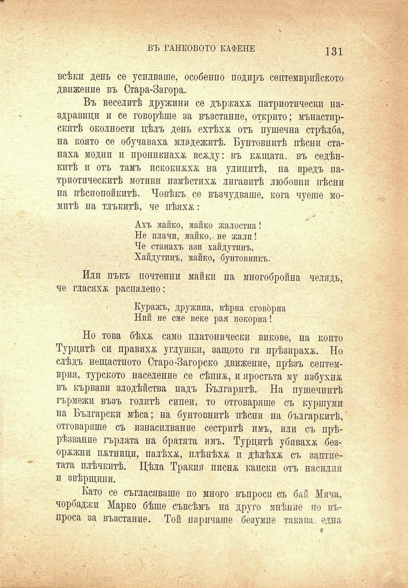

ВЪ ТАНКОВОТО КАФЕНЕ	131

всѣки день се усилваше, особенно подиръ септемврийското движение въ Стара-Загора.

Въ веселитѣ дружини се държахъ патриотически наздравици и се говорѣше за възстание, открито; мънастирскптѣ околности цѣлъ день ехтѣхѫ отъ пушечна стрѣлба, на която се обучаваха младежитѣ. Бунтовнитѣ пѣсни станаха модни и проникнаха всаду: въ кѫщата, въ седѣнкитѣ и отъ тамъ пскокн^х^ на улицитѣ, на вредъ патриотическитѣ мотиви измѣстихѫ лигавитѣ любовни пѣсни на пѣснопойкитѣ. Човѣкъ се възчудваше, кога чуеше момитѣ на тлъкитѣ, че пѣяхж:

Ахъ лайко, майко жалостна!

Не плачи, майко,-не жали! Че станахъ азп хайдутинъ, Хайдутинъ, шайко, бунтовникъ.

Или пъкъ почтений майки па многобройна челядь, че гласихѫ распалено:

Куражъ, дружина, вѣрна сговорна Ний не сме веке рая покорна'.

Но това бѣхл само платонически викове, на който Турцитѣ си правихѫ углушки, защото ги прѣзираха. Но слѣдъ нещастното Старо-Загорско движение, прѣзъ септемврия, турското население се сѣппж, и яростьта му избухна въ кървави злодѣйства надъ Българитѣ. На пушечнитѣ гърмежи възъ голитѣ сипеи, то отговаряше съ куршуми на Български мѣса; на бунтовнитѣ пѣсни па българкитѣ, отговаряше съ изнасилвание сестритѣ имъ, или съ прѣрѣзвание гърлата на братята имъ. Турцитѣ убиваха безоржжни потници, палѣха, плѣнѣха и дѣлѣха съ заптиетата плѣчкитѣ. Цѣла Тракия писна; кански отъ насилия и звѣрщини.

Като се съгласяваше по много въпроси съ бай Мпча, чорбаджи Марко бѣше съвсѣмъ на друго мпѣние по въпроса за възстание. Той наричаше безумие такава една

