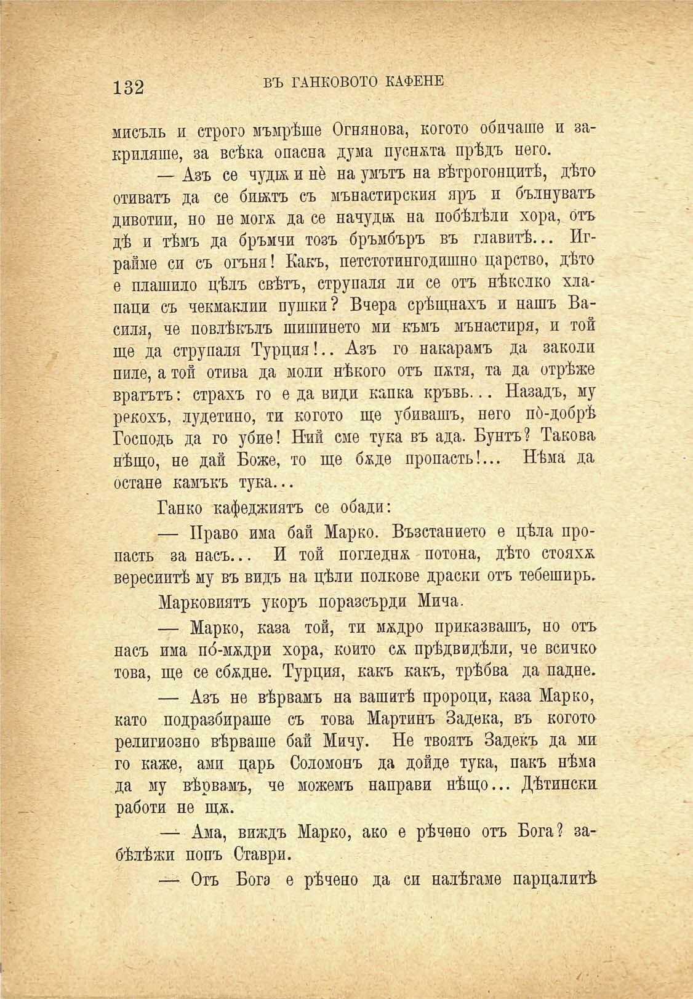

132	въ ТАНКОВОТО КАФЕНЕ

мисъль и строго мъмрѣше Огнянова, когото обичаше и закриляше, за всѣка опасна дума пусната прѣдъ него.

— Азъ се чудж и не на умътъ на вѣтрогонитѣ, дѣто отиватъ да се бижтъ съ мънастирския яръ и бълнуватъ дивотии, но не мога да се начуди на побѣлѣли хора, отъ дѣ и тѣмъ да бръмчи тозъ бръмбъръ въ главитѣ... Играйме си съ огъня! Какъ, петстотингодишно царство, дѣто е плашило цѣлъ свѣтъ, струпала ли се отъ нѣколко хлапаци съ чекмаклии пушки? Вчера срѣщнахъ и нашъ Василя, че повлѣкълъ шишинето ми къмъ мънастиря, и той ще да струпала Турцпа!.. Азъ го накарамъ да заколи пиле, а той отива да моли нѣкого отъ патя, та да отрѣже вратътъ: страхъ го е да види капка кръвь... Назадъ, му рекохъ, лудетино, ти когото ще убивашъ, него по́-добрѣ Господь да го убие! Ний сме тука въ ада. Бунтъ? Такова нѣщо, не дай Боже, то ще баде пропасть!... Нѣма да остане камъкъ тука...

Банко кафеджиятъ се обади:

— Право има бай Марко. Възстанието е цѣла пропасть за насъ... И той погледна потона, дѣто стояха вересиитѣ му въ видъ на цѣли полкове драски отъ тебеширъ.

Парковиятъ укоръ поразсърди Мича.

— Марко, каза той, ти мадро приказвашъ, но отъ насъ има по́-мадри хора, който са прѣдвидѣли, че всичко това, ще се сбадне. Турция, какъ какъ, трѣбва да падне.

— Азъ не вѣрвамъ на вашитѣ пророци, каза Марко, като подразбираше съ това Мартинъ Задека, въ когото религиозно вѣрваше бай Мичу. Не твоятъ Заденъ да ми го каже, ами царь Соломонъ да дойде тука, пакъ нѣма да му вѣрвамъ, че можемъ направи нѣщо... Дѣтински работи не ща.

— Ама, виждъ Марко, ако е рѣчено отъ Бога? забѣлѣжи попъ Ставри.

— Отъ Бога е рѣчено да си налѣгаме парцалитѣ.

