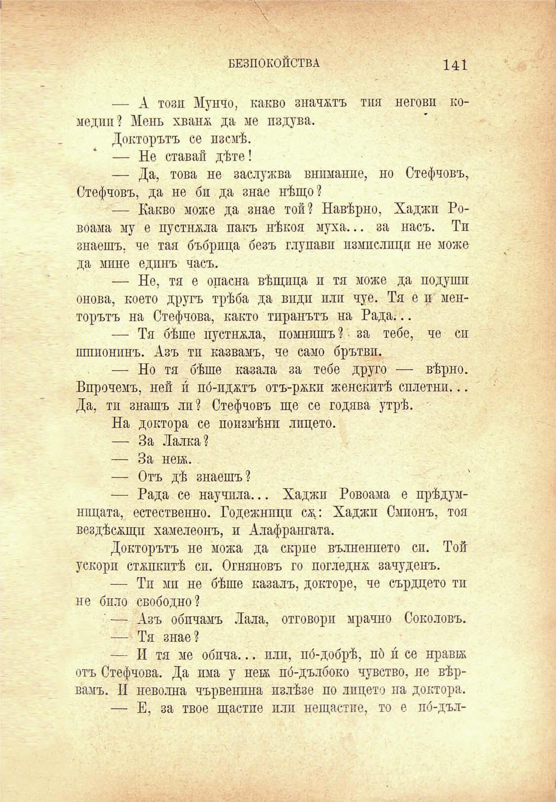

БЕЗПОКОЙСТВА

141

— А този Мунчо, какво значатъ тия негови комедии? Мень хванж да ме издува.

Докторътъ се изсмѣ.

— Не ставай дѣте!

— Да, това не заслужва внимание, но Стефчовъ, Стефчовъ, да не би да знае нѣщо?

— Какво може да знае той? Навѣрно, Хаджи Ровоама му е пустнжла пакъ нѣкоя муха... за насъ. Ти знаешъ, че тая бъбрица безъ глупави измислици не може да мине единъ часъ.

— Не, тя е опасна вѣщица и тя може да подуши онова, което другъ трѣба да види или чуе. Тя е и менторътъ на Стефчова, както тиранътъ на Рада...

— Тя бѣше пустнжла, помнишъ ? за тебе, че сп шпионинъ. Азъ ти казвамъ, че само брътви.

— Но тя бѣше кавала за тебе друго — вѣрно. Впрочемъ, ней и по́-иджтъ отъ-ржки женскитѣ сплетни... Да, тп знашъ ли? Стефчовъ ще се годява утрѣ.

На доктора се поизмѣни лицето.

— За Лалка?

— За неж.

— Отъ дѣ знаешъ?

— Рада се научпла... Хаджи Ровоама е прѣдумнпцата, естественно. Годежнпцп сж: Хаджи Смпонъ, тоя вездѣсжщп хамелеонъ, и Алафрангата.

Докторътъ не можа да скрие вълнението сп. Той ускори стѫпкитѣ си. Огняновъ го погледна зачуденъ.

— Тп мп не бѣше казалъ, докторе, че сърдцето ти не било свободно?

' — Азъ обичамъ Лала, отговори мрачно Соколовъ.

— Тя знае?

— И тя ме обича... или, по́-добрѣ, пб и се нравгж отъ Стефчова. Да има у неѭ по́-дълбоко чувство, не вѣрвамъ. И неволна чървенпна пзлѣзе по лицето на доктора.

— Е, за твое щастпе или нещастие, то е по́-дъл-

