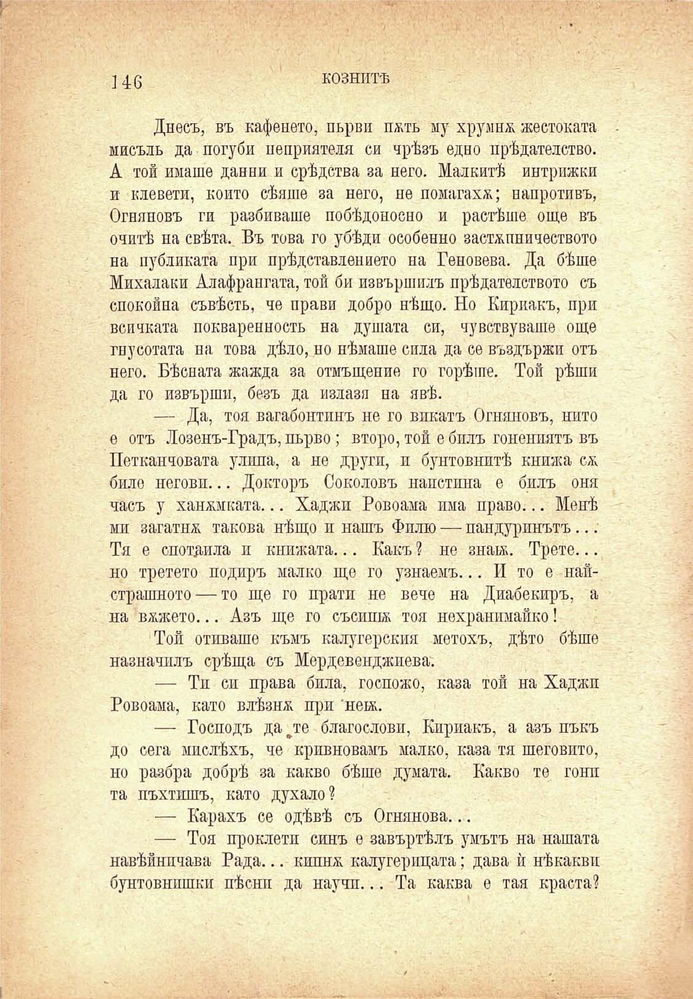



КОЗЛИТѢ

146

Днесъ, въ кафенето, първи пжть му хрумна жестоката мисъль да погуби неприятеля си прѣзъ едно прѣдателство. А той имаше данни и срѣдства за него. Малкитѣ интрижки и клевети, който сѣяше за него, не помагаха; напротивъ, Огняновъ ги разбиваше побѣдоносно и растѣше още въ очитѣ на свѣта. Въ това го убѣди особенно застѫпничеството на публиката при прѣдставлението на Геновева. Да бѣше Михалаки Алафрангата, той би извършилъ прѣдателството съ спокойна съвѣсть, че прави добро нѣщо. Но Кириакъ, при всичката покваренность на душата си, чувствуваше още гнусотата на това дѣло, но нѣмаше сила да се въздържи отъ него. Бѣсната жажда за отмъщение го горѣше. Той рѣши да го извърши, безъ да излази на явѣ.

— Да, тоя вагабонтинъ не го викатъ Огняновъ, нито е отъ Лозенъ-Градъ, пьрво; второ, той е бплъ гонениятъ въ Петканчовата улипа, а не други, и бунтовнитѣ книжа сж. било негови... Докторъ Соколовъ наистина е билъ оня часъ у ханхмката... Хаджи Ровоама има право... Менѣ ми загатна такова нѣщо и нашъ Фплю — пандурпнътъ... Тя е спотдила и книжата... Какъ ? не знакъ. Трете... но третото подиръ малко що го узнаемъ... И то е найстрашното — то ще го прати не вече на Диабекиръ, а на вѫжето... Азъ ще го съсипи; тоя нехранимайко!

Той отиваше къмъ калугерския метохъ, дѣто бѣше назначилъ срѣща съ Мердевенджиева.

— Ти си права била, госпожо, каза той на Хаджи Ровоама, като влѣзна при пекъ.

— Господъ да/те благослови, Кириакъ, а азъ пъкъ до сега мислѣхъ, че кривновамъ малко, каза тя шеговито, но разбра добрѣ за какво бѣше думата. Какво те гони та пъхтишъ, като духало?

— Карахъ се одѣвѣ съ Огнянова...

— Тоя проклети синъ е завъртѣлъ умътъ на нашата навѣйнпчава Рада... кипнж калугерицата; дава ѝ нѣкакви бунтовнишки пѣсни да научи... Та каква е тая краста?

