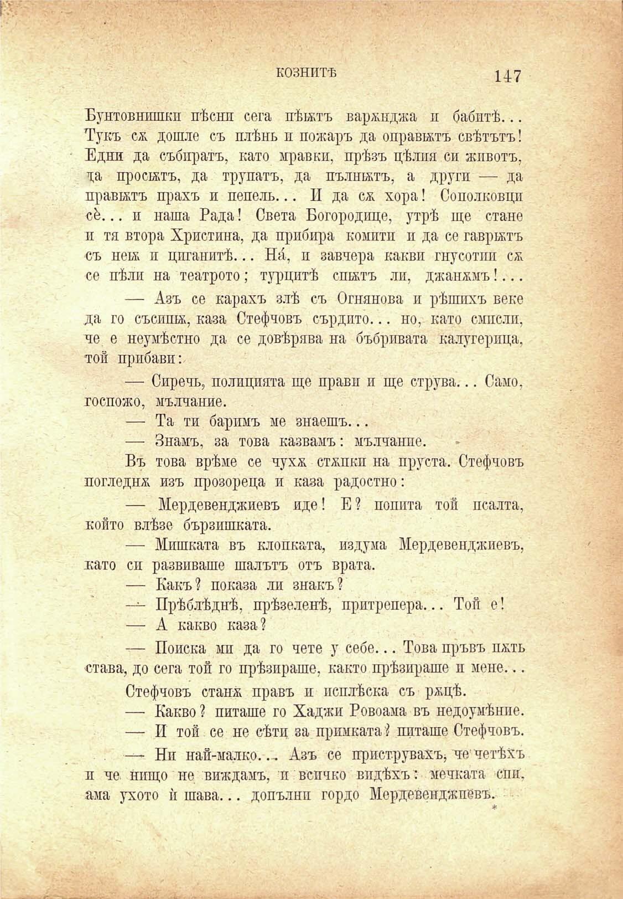

КОЗНИТѢ

147

Бунтовнишки пѣсни сега пѣ1жтъ варжнджа и бабитѣ... Тукъ сѫ дошле съ плѣнъ и пожаръ да оправятъ свѣтътъ! Едни да събиратъ, като мравки, прѣзъ цѣлия си животъ, да проектъ, да трупатъ, да пълнятъ, а други — да правятъ прахъ и пепель... II да сѫ хора! Сополковци ей... и наша Рада! Света Богородице, утрѣ ще стане п тя втора Христина, да прибира комити и да се гаврятъ съ неъж и циганитѣ... На́, и завчера какви гнусотии сж се пѣли на театрото; турцитѣ сшжтъ ли, джанжмъ!...

— Азъ се карахъ злѣ съ Огнянова и рѣшихъ веке да го съсишж, каза Стефчовъ сърдито... но, като смпсли, че е неумѣстно да се довѣрява на бъбривата калугерица, той прибави:

— Сиречъ, полицията ще прави и ще струва... Само, госпожо, мълчание.

— Та ти барпмъ ме знаешъ...

— Знамъ, за това казвамъ: мълчание.

Въ това врѣме се чухж стжпкп на пруста. Стефчовъ погледнж изъ прозореца и каза радостно:

— Мердевенджиевъ иде! Е ? попита той псалта, който влѣзе бързишката.

— Мишката въ клопката, издума Мердевенджиевъ, като си развиваше шалътъ отъ врата.

— Какъ? показа ли знакъ?

Прѣблѣднѣ, прѣзеленѣ, притрепера... Той е! — А какво каза?

— Поиска ми да го чете у себе... Това пръвъ пжть става, до сега той го прѣзираше, както прѣзираше и мене...

Стефчовъ станж правъ и исплѣска съ ржцѣ.

— Какво ? питаше го Хаджи Ровоама въ недоумѣние. — И той се не сѣти за примката ? питаше Стефчовъ. — ни най-малко.. , Азъ се приструвахъ, че четѣхъ п че нищо не виждамъ, и всичко видѣхъ: мечката спи. ама ухото ѝ шава... допълни гордо Мердевенджпевъ.

