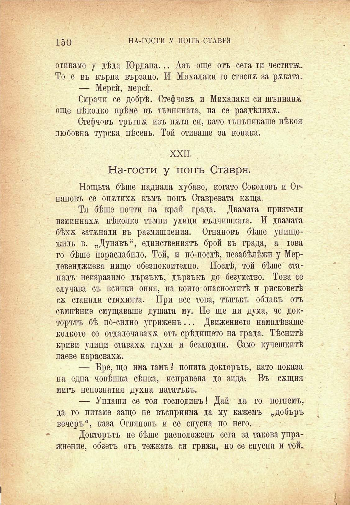

150

НА-ГОСТИ У ПОПЪ СТАВРЯ

отиваме у дѣда Юрдана... Азъ още отъ сега ти честита. То е въ кърпа вързано. И Михалаки го стисна за ржката.

— Мерсѝ, мерсѝ.

Смрачи се добрѣ. Стефчовъ и Михалаки си шъпнанж още нѣколко врѣме въ тъмнината, па се раздѣлиха.

Стефчовъ тръгна изъ пжтя си, като тънъникаше нѣкоя любовна турска пѣсень. Той отиваше за конака.

XXII.

На-гости у попъ Ставря.

Нощьта бѣше паднала хубаво, когато Соколовъ и Огняновъ се опжтихж къмъ попъ Ставревата кжща.

Тя бѣше почти на край града. Двамата приятели изминнахж нѣколко тъмни улици мълчишката. И двамата бѣхѫ затупали въ размишления. Огняновъ бѣше унищожиль в. „Дунавъ“, единствениятъ брой въ града, а това го бѣше пораслабило. Той, и по́-послѣ, пезабѣлѣжи у Мердевенджиева нищо обезпокоително. Послѣ, той бѣше станалъ неизразимо дързъкъ, дързъкъ до безумство. Това се случава съ всички ония, на който опасноститѣ и рисковетѣ сж станали стихията. При все това, тънъкъ облакъ отъ съмпѣние смущаваше душата му. Не ще ни дума, че докторътъ бѣ по́-силно угриженъ... Движението намалѣваше колкото се отдалечаваха отъ срѣдището на града. Тѣснитѣ криви улици ставаха глухи и безлюдни. Само кучешкитѣ лаеве нарасвахж.

— Бре, що има тамъ ? попита докторътъ, като показа на една човѣшка сѣнка, исправена до зида*. Въ сжщия мигъ непознатия духна нататъкъ.

— Уплаши се тоя господинъ! Дай да го погнемъ, да го питаме защо не въсприима да му кажемъ „добъръ вечеръ“, каза Огняновъ и се спусна по него.

Докторътъ не бѣше расположенъ сега за такова упражнение, обзетъ отъ тежката си грижа, но се спусна и той..

