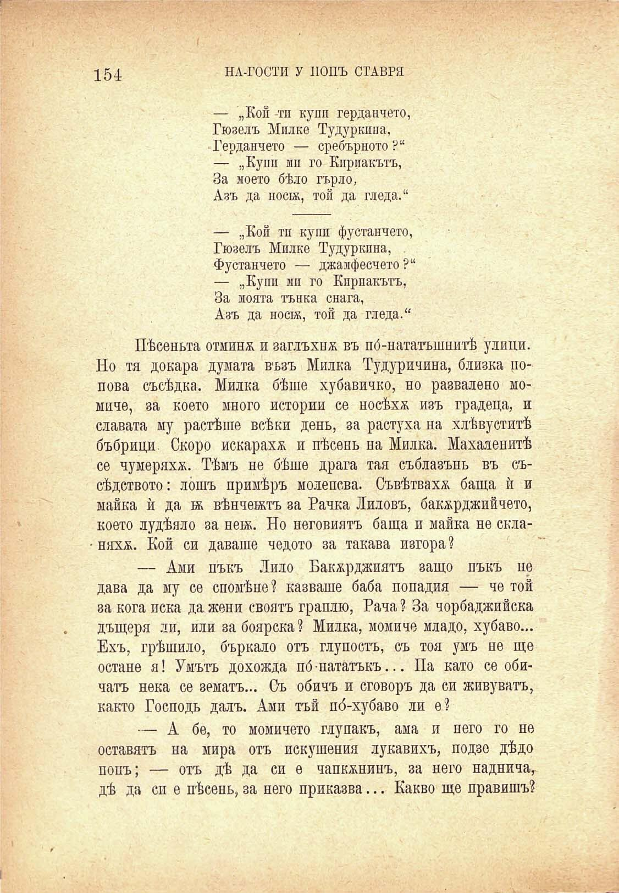

154

НА-ГОСТИ У ПОПЪ СТАВРЯ

— „Кой тп купи гердапчето, Гюзелъ Мплке Тудуркпна, Герданчето — сребърното ?“ — „Купи мп го Кириакътъ, За моето бѣло гърло, Азъ да нос1Ж, той да гледа.“

— „Кой тп купи фустанчето, Гюзелъ Мплке Тудуркпна, Фустанчето — джамфесчето ?“ — „Купи мп го Кприакътъ, За моята тънка снага, Азъ да носбк, той да гледа.“

Пѣсеньта отминъ и заглъхна въ по́-нататашнитѣ улици. Но тя докара думата възъ Милка Тудуричина, близка цопова съсѣдка. Милка бѣше хубавичко, но развалено момиче, за което много истории се носѣха изъ градеца, и славата му растѣше всѣки день, за растуха на хлѣвуститѣ бъбрици Скоро искарахъ и пѣсень на Милка. Махаленитѣ се чумеряхъ. Тѣмъ не бѣше драга тая съблазънь въ съсѣдството: лошъ примѣръ молепсва. Съвѣтвахъ баща ѝ и майка ѝ да бк вѣнчежтъ за Бачка Лиловъ, бакърджийчето, което лудѣяло за новъ. Но неговиятъ баща и майка не скланяха. Кой си даваше чедото за такава изгора?

— Ами пъкъ Лило Бакърджията защо пъкъ не дава да му се спомѣне? казваше баба попадия — че той за кога иска да жени своятъ граплю, Рача ? За чорбаджийска дъщеря ли, или за боярска? Милка, момиче младо, хубаво... Ехъ, грѣшило, бъркало отъ глупостъ, съ тоя умъ не ще остане я! Умътъ дохожда пб - нататъкъ... Па като се обичатъ нека се земята... Съ обичъ и сговоръ да си живувата, както Господь далъ. Ами тай по́-хубаво ли е?

— А бе, то момичето глупакъ, ама и него го не оставятъ на мира отъ искушения лукавихъ, подзе дѣдо попъ; — отъ дѣ да си е чапкънинъ, за него наднича^ дѣ да си е пѣсень, за него приказва... Какво ще правишъ?

