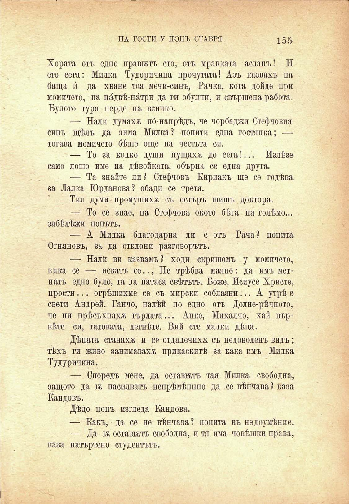

НА ГОСТИ У ПОПЪ СТАВРЯ

155

Хората отъ едно праватъ сто, отъ мравката асланъ! И ето сега: Милка Тудоричина прочутата! Азъ казвахъ на баща и́ да хване тоя мечи-синъ, Рачка, кога дойде при момичето, па ни́двѣ-ни́три да ги обулчи, и свършена работа. Булото туря перде на всичко.

— Нали думахж по́-напрѣдъ, че чорбаджи Стефчовия синъ щѣлъ да зима Милка? попити една гостянка; — тогава момичето бѣше още на честьта си.

— То за колко души пущаха до сега!... Излѣзе само лошо име на дѣвойката, обърна се една друга.

— Та знайте ли? Стефчовъ Кириакъ ще се годѣва за Лалка Юрданова? обади се третя.

Тия думи промушихѫ съ остъръ шишъ доктора.

— То се знае, па Стефчова окото бѣга на голѣмо... забѣлѣжи попътъ.

— А Милка благодарна ли е отъ Рача? попита Огняновъ, за да отклони разговорътъ.

— Нали ви казвамъ? ходи скришомъ у момичето, вика се — искатъ се.., Не трѣбва маяне: да имъ метнатъ едно було, та да патаса свѣтътъ. Боже, Исиусе Христо, прости... сгрѣшихме се съ мирски соблазни... А утрѣ е свети Андрей. Ганчо, налѣй по едно отъ Долне-рѣчното, че ни прѣсъхнаха гърлата... Анке, Михалчо, хай вървѣте си, татовата, легнѣте. Вий сте малки дѣна.

Дѣцата станаха и се отдалечихѫ съ недоволенъ видъ; тѣхъ ги живо занимаваха прикаскитѣ за кака имъ Милка Тудуричина.

— Споредъ мене, да оставатъ тая Милка свободна, защото да а насилватъ непрѣмѣняно да се вѣнѝава? каза Кандовъ.

Дѣдо попъ изгледа Кандова.

— Какъ, да се не вѣнчава? попита въ недоумѣние.

— Да а оставатъ свободна, и тя има човѣшки права,

каза натъртено студентътъ.

