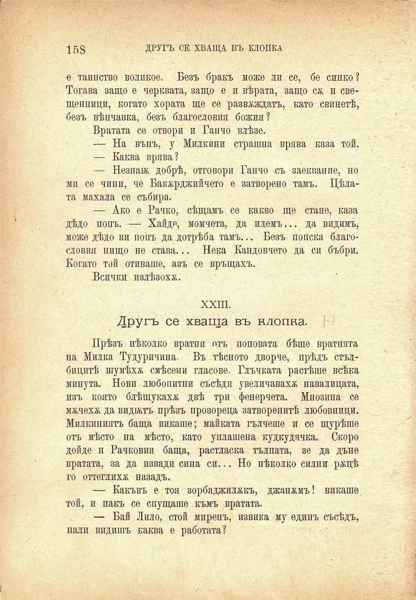

158

ДРУГЪ СЕ ХВАЩА. ВЪ КЛОПКА

е тайнство волпкое. Безъ бракъ може ли се, бе синко? Тогава защо е черквата, защо е и вѣрата, защо с& и свещенници, когато хората ще се развеждатъ, като свинетѣ, безъ вѣнчавка, безъ благословия божия?

Вратата се отвори и Ганчо влѣзе.

— На вънъ, у Милкини страшна врява каза той.

— Каква врява?

— Незнаж добрѣ, отговори Ганчо съ заекванпе, но ми се чини, че Бакърджии чето е затворено тамъ. Цѣлата махала се събира.

— Ако е Рачко, сѣщамъ се какво ще стане, каза дѣдо попъ. — Хайде, момчета, да идемъ... да видимъ, може дѣдо ви попъ да дотрѣба тамъ... Безъ попска благословия нищо не става... Нека Кандовчето да си бъбри. Когато той отиваше, азъ се връщахъ.

Всички излѣзоха.

XXIII.

Другъ се хваща въ клопка. '

Прѣзъ нѣколко вратни отъ поповата бѣше вратнята на Милка Тудуричина. Въ тѣсното дворче, прѣдъ стълбицитѣ шумѣхе смѣсени гласове. Глъчката растѣше всѣка минута. Нови любопитни съсѣди увеличаваха навалицата, изъ която блѣщукаха двѣ три фенерчета. Мнозина се мжчехж да видътъ прѣзъ прозореца затворенитѣ любовници. Милкиниятъ баща викаше; майката гълчеше и се щурѣше отъ мѣсто на мѣсто, като уплашена кудкудячка. Скоро дойде и Рачковия баща, растласка тълпата, зе да дъне вратата, за да извади сина си... Но нѣколко силни ржцѣ го оттеглихѫ назадъ.

— Какъвъ е тоя зорбаджилжкъ, джанжмъ! викаше той, и пакъ се спущаше къмъ вратата.

— Бай Лѝло, стой миренъ, извика му единъ съсѣдъ,

нали видишъ каква е работата?

