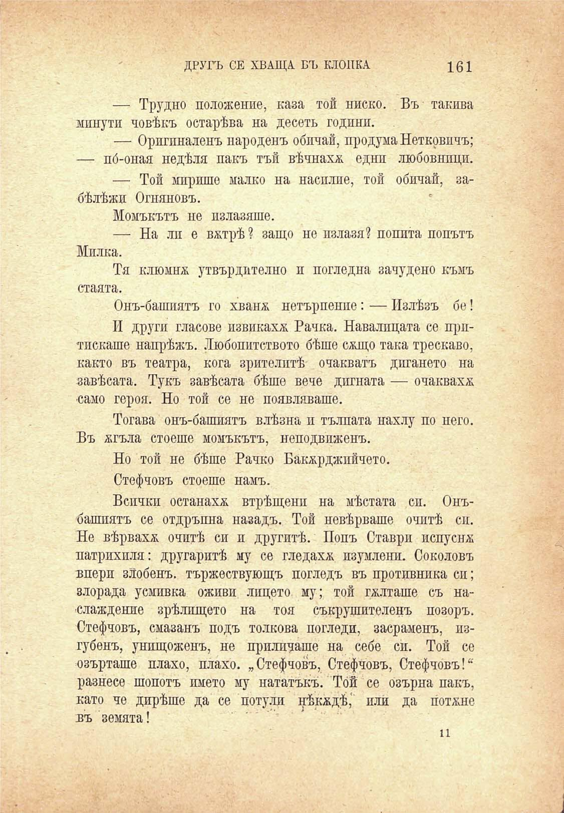

ДРУГЪ СЕ ХВАЩА. ВЪ КЛОПКА

161

— Трудно положение, каза той ниско. Въ такива минути човѣкъ остарѣва на десеть години.

— Оригиналенъ народенъ обичай, продума Нетковичъ; — по́-оная недѣля пакъ тъй вѣчнахж едни любовници.

— Той мирише малко на насилие, той обичай, забѣлѣжи Огняновъ.

Момъкътъ не пзлазяше.

— На ли е вмтрѣ ? защо не пзлазя? попита попътъ Милка.

Тя клюмнм утвърдително и погледна зачудено къмъ стаята.

Онъ-башиятъ го хванж нетърпение: — Излѣзъ бе!

И други гласове извикаха Бачка. Навалицата се притискаше напрѣжъ. Любопитството бѣше сжщо така трескаво, както въ театра, кога зрителитѣ очакватъ дигането на завѣсата. Тукъ завѣсата бѣше вече дигната — очакваха •само героя. Но той се не появляваше.

Тогава онъ-башиятъ влѣзна и тълпата нахлу по него. Въ жгъла стоеше момъкътъ, неподвиженъ.

Но той не бѣше Рачко Бакжрджийчето.

Стефчовъ стоеше намъ.

Всички останаха втрѣщени на мѣстата сп. Онъбашиятъ се отдръпна назадъ. Той невѣрваше очитѣ си. Не вѣрваха очитѣ си и другитѣ. Попъ Ставри испуснж патрихпля: другаритѣ му се гледаха изумлени. Соколовъ впери злобенъ, тържествующъ погледъ въ противника си; злорада усмивка оживи лицето му; той гълташе съ наслаждение зрѣлшцето на тоя съкрушителенъ позоръ. Стефчовъ, смазанъ подъ толкова погледи, засраменъ, изгубенъ, унищоженъ, не приливаше на себе си. Той се озърташе плахо, плахо. „Стефчовъ, Стефчовъ, Стефчовъ!“ разнесе шопотъ името му нататъкъ. Той се озърна пакъ, като че дирѣше да се потули нѣкждѣ, или да поташе въ земята!

н

